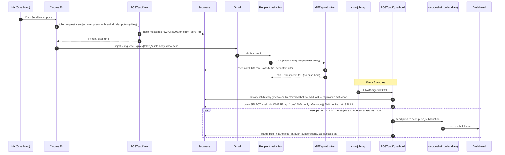
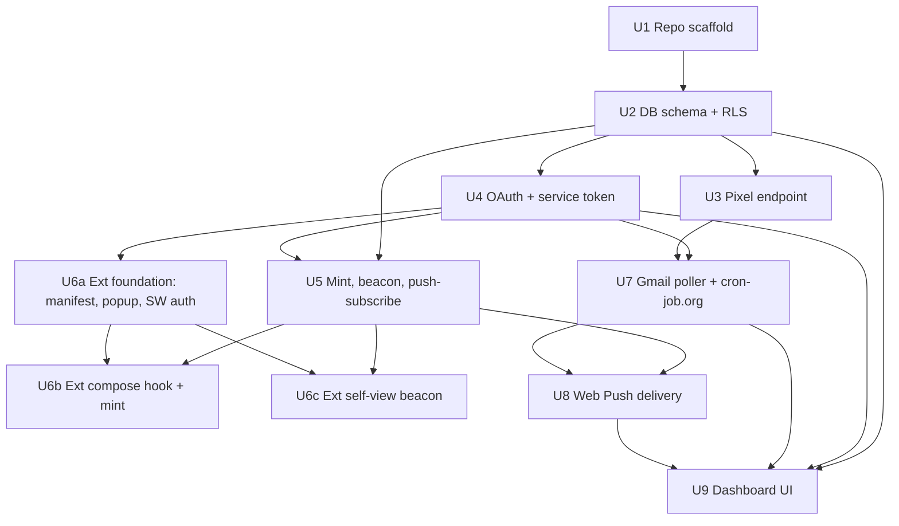

# feat: Personal Email Tracker (Mailsuite-style, self-hosted, free-tier)

## Enhancement Summary (Deepening Pass 2 — 2026-05-08)

**Sections enhanced:** Context & Research, Key Technical Decisions, Open
Questions, Decision matrices, all 11 implementation units, Risks,
Documentation.

**Agents consulted:** scope-guardian, simplicity-review, design-lens-review,
maintainability-review, api-contract-review, unslop-review,
performance-review, data-migration-review, feasibility-review,
framework-docs-research, coherence-review, adversarial-doc-review.

**Key corrections from this pass:**

1. **Polling driver switched from GitHub Actions to cron-job.org.** Private-
   repo GH Actions bills minute-rounded → ~$50/mo at 5-min cadence. cron-job.org
   is free, supports 1-min cadence, and the function-side auth (HMAC) is
   unchanged.
2. **`messageRead` is not a Gmail History enum.** Replaced with
   `labelRemoved` + `labelId=UNREAD` filter throughout U7. The four real
   `historyTypes` are `messageAdded`, `messageDeleted`, `labelAdded`,
   `labelRemoved`.
3. **OAuth refresh-token capture rewritten.** The Supabase admin API does not
   return Google `provider_refresh_token`. Now uses the documented client-side
   handoff: dashboard reads `session.provider_refresh_token` from the Supabase
   client right after Google OAuth and POSTs it to `/api/oauth-finalize` with
   the user's JWT. Requires `access_type=offline&prompt=consent` on the
   initial sign-in.
4. **End-to-end notification latency claim corrected.** Previous "within ~90s"
   was wrong; with poll-driven push, typical is ~3–5 min and worst-case
   ~12 min. Already inside the relaxed 15-min target.
5. **Inline push in `pixel.ts` removed.** The poller's drain step is now the
   sole push path (notification latency ≤ ~5 min worst case under the
   relaxed target). Removes the inline-fetch failure modes, the
   `pg_advisory_xact_lock`-vs-CAS overlap, and the duplicated dedupe code.
6. **FK `ON DELETE CASCADE` declared explicitly** on every FK that targets
   `users(id)` and on `pixel_hits.message_id`. Unit 9 promised cascade
   semantics; the schema now matches.
7. **`pgcrypto` extension declared explicitly** so `gen_random_uuid()` is
   guaranteed available (Supabase pre-installs it, but be portable).
8. **`gmail_credentials` upsert uses `COALESCE(EXCLUDED.refresh_token, …)`**
   so subsequent sign-ins (where Google omits the refresh token) don't NULL
   out the stored one.
9. **`/api/mint` now requires an `Idempotency-Key` header**, backed by a
   `messages.client_send_id` UNIQUE column. Network-retry safe.
10. **CORS preflight specifies `Max-Age: 86400` and `Allow-Headers`** including
    `Idempotency-Key`. Single helper at `functions/lib/cors.ts` (declared in
    Unit 5; phantom file fixed).
11. **Standardized error envelope** `{ error: { code, message, details? } }`
    via `functions/lib/respond.ts`.
12. **Multi-issue HealthBanner**, page-level empty states, mobile responsive
    layout, allowlist check on sign-in, push `notificationclick` deep-link
    handler — all added to U9.
13. **Dropped scope:** `event_log` table + endpoint + panel; `/api/data-export`;
    Poll-Now button; `notify_attempts` retry budget (one attempt + log instead);
    inline pixel push; `system_health` trimmed from 7 to 4 R22-named signals.
14. **Stable extension ID** via the `"key"` field in `manifest.json` so the
    `chrome-extension://<EXTENSION_ID>` CORS allowlist value is stable across
    machines.

### Open caveats raised but **not** acted on (deferred for user judgement)

- **Apple Mail Privacy Protection** opens every image via a proxy at receive
  time. For recipients on Apple Mail (~30–40% of consumer mail in 2026), the
  pixel hit is more "delivered" than "opened." Documented in Open Questions
  and surfaced in the dashboard via a per-recipient notice.
- **Recipient-side ethics** (per-send opt-out gesture, per-recipient blocklist,
  signature disclosure) — added as an Open Question.
- **Bookmarklet alternative** to the Chrome extension (would drop ~25% of the
  plan) — added as a deferred Open Question, not chosen.

## Overview

Greenfield build of a personal Mailtrack/Mailsuite equivalent for a single
Gmail account. Three surfaces glued together:

1. A **Manifest V3 Chrome extension** that hooks Gmail's web compose UI to
   inject a tracking pixel into every outgoing message and beacons when I'm
   viewing my own sent threads.
2. A **set of Netlify Functions** (pixel endpoint, mint, beacon,
   push-subscribe, gmail-poll, dashboard API) backed by a **Supabase Postgres
   database** with **Supabase Auth (Google OAuth)**.
3. A **static dashboard** (Netlify CDN) that lists tracked messages, opens,
   and system health, plus delivers **Web Push** notifications.

A **cron-job.org schedule** pings the gmail-poll function every 5 minutes
to suppress mobile self-opens via the Gmail History API. Everything fits
the free tiers of Netlify, Supabase, and cron-job.org.

## Problem Frame

Personal Gmail user wants Mailsuite-grade open tracking without paying. Volume
is low (<50 sends/day), but the system must be transparent (zero per-send
clicks), suppress my own opens across desktop and mobile, present results in a
clean dashboard, and stay inside free tiers indefinitely. See origin:
[docs/brainstorms/2026-05-08-personal-email-tracker-requirements.md](../brainstorms/2026-05-08-personal-email-tracker-requirements.md).

## Requirements Trace

Plan covers all 22 requirements from the origin document. Mapping is shown in
each Implementation Unit's `Requirements:` field.

- **R1, R2, R5** — Chrome extension (Units 6a, 6b, 6c)
- **R3** — token mint + recipient capture (Unit 5)
- **R4** — single shared pixel; dashboard semantics (Units 5, 9)
- **R6, R7, R8, R9** — pixel endpoint, event capture, proxy detection (Unit 3)
- **R10, R11, R12, R13** — tagging pipeline + Gmail History poller (Units 3, 7)
- **R14, R15, R16** — dashboard UI + Google OAuth + delete action (Units 4, 9)
- **R17, R18** — Web Push subscribe + delivery (Units 5, 8)
- **R19, R20** — Netlify + Supabase free tier; custom domain optional (Units 1, 2)
- **R21** — endpoint authentication (Units 4, 5, 6a)
- **R22** — system health (Units 7, 9)

## Scope Boundaries

Carried forward from origin (not re-litigated here):

- Out: link/click tracking; per-recipient attribution on multi-recipient
  sends; forward attribution; inline Gmail UI (checkmarks); Gmail mobile
  pixel injection; multi-user/SaaS; Chrome Web Store distribution; rich
  device/UA fingerprinting beyond Netlify's geo.

Plan-level additions:

- Out for v1: link tracking, mail-merge fan-out, automated extension auto-update.
- Defer to v1.5: custom domain (R20), manual delete (R16) — both flagged
  optional in the origin.

## Context & Research

### Relevant Code and Patterns

Greenfield — the repo currently contains only ATV scaffolding under
`.github/`, `.atv/`, and `docs/`. There are no existing application code
patterns to mirror. New top-level directories will be added (see Unit 1).

### Institutional Learnings

`docs/solutions/` is empty; no prior local learnings apply.

### External References

- **Gmail compose interception (Manifest V3, 2026):** `MutationObserver` on
  Gmail's compose dialog with selector
  `div[role="dialog"][aria-label*="Message"]` and a child
  `div[role="button"][aria-label*="Send"]` is the mainstream
  InboxSDK-free approach. Selectors drift; treat as configuration, not
  hard-coded. Capture-phase click listener (`addEventListener('click', fn,
  true)`) is required to intercept before Gmail's own handler. The hijack
  uses **`stopImmediatePropagation()`** (not just `stopPropagation()`) so
  Gmail's other capture-phase handlers don't also fire.
- **Netlify Functions free tier (2026):** synchronous functions have a
  **60-second** maximum execution time on the Free plan (was 10s pre-2024;
  the 10s value sometimes still appears in stale docs). Background functions
  go to 15 min. The plan's drain-LIMIT-50 batch fits comfortably inside 60s.
- **Netlify Scheduled Functions free tier:** minimum cron interval is
  **hourly**, not minute-level. Sub-hourly polling requires an external
  driver. **Decision: cron-job.org** runs a 5-minute schedule against the
  function endpoint with an HMAC-signed header. Free for unlimited jobs at
  ≥1-min cadence; documented uptime since ~2010. Worst-case combined latency
  with a 5-minute schedule + ~1-min skew + ~1-min function execution is
  well inside the relaxed 15-minute success criterion.
- **Gmail API users.history.list vs Pub/Sub:** for a single user at low
  frequency, polling with `historyId` is the recommended simpler path.
  Pub/Sub adds a GCP topic, IAM, and a 7-day `watch()` renewal cron — not
  worth the complexity at this scale.
- **Gmail API History `historyTypes`:** the **only valid values** are
  `messageAdded`, `messageDeleted`, `labelAdded`, `labelRemoved`. There is
  **no** `messageRead` historyType. Mobile self-read detection uses
  `historyTypes=labelRemoved` and filters events to those whose
  `labelsRemoved` includes the `UNREAD` system label. The
  `users.history.list` call also supports `?labelId=UNREAD` to narrow
  server-side.
- **Gmail OAuth scope `gmail.metadata`:** classified as **RESTRICTED** (more
  sensitive than "Sensitive"). For a personal app used only by the operator's
  own Google account, publishing the OAuth client to **In production** mode
  removes the 7-day Testing-mode refresh-token expiry, but the app still
  shows an "unverified" warning the first time. The published-with-warning
  workaround is undocumented but widely used; expect that this gray zone may
  tighten over time and you may need to apply for verification later.
- **Gmail image proxy caching:** ignores `Cache-Control: no-store`. **Repeat
  opens by the same recipient on Gmail will usually not register** — Google
  serves cached pixel after first fetch. Per-request cache-busting query
  strings inside the email body would defeat repeat tracking only if the
  email body itself were rewritten per view (impossible). Conclusion: R8's
  "repeat opens produce additional rows" remains true for non-Gmail
  recipients, opens via different proxies, and clients that bypass image
  proxying. For Gmail-to-Gmail, expect mostly only the first open. Document
  this in the dashboard UI.
- **Apple Mail Privacy Protection (MPP, 2026):** for ~30–40% of consumer
  recipients (Apple Mail on macOS/iOS with default settings), every image is
  fetched at receive time via Apple's proxy, regardless of whether the user
  ever actually opens the message. **Tracking pixels for these recipients
  produce a hit-on-receipt that is not an open.** Surface as a
  per-recipient notice (`AppleMPPNotice` component, U9). Documented as an
  Open Question — not solved here.
- **Chrome `chrome.identity.getAuthToken`:** does **not** return a refresh
  token. The server-side Gmail History poller obtains its refresh token
  via Supabase's Google OAuth flow (`access_type=offline&prompt=consent`)
  with the `gmail.metadata` scope, captured by the dashboard immediately
  after sign-in and POSTed to `/api/oauth-finalize` (see Key Technical
  Decisions for the handoff mechanics).
- **Web Push (`web-push` npm package):** standard VAPID flow. Subscription
  objects (`endpoint`, `keys.p256dh`, `keys.auth`) stored in Supabase; on
  delivery, prune entries that return **HTTP 404 or 410 (Gone)** — both
  indicate the subscription is permanently dead. Rotating the VAPID keypair
  invalidates **all** existing subscriptions silently; document this in
  README and add a "Re-subscribe to push" button in U9 for recovery.
- **Supabase Auth in Chrome extensions (MV3):** the extension authenticates
  to the backend with a **service token** issued by a one-time pairing flow
  (paste an 80-bit code generated by the dashboard). Service tokens are
  stored in `chrome.storage.local` (persists across MV3 service-worker
  evictions; in-memory state would not). All extension `fetch` calls run
  **inside the content script**, not via `chrome.runtime.sendMessage` to the
  service worker, because an in-flight Promise inside the SW dies when the
  SW is evicted (~30s idle).
- **Supabase OAuth provider tokens (client-side handoff):** after a
  successful Google OAuth via `supabase.auth.signInWithOAuth({ provider:
  'google', options: { scopes, queryParams: { access_type: 'offline',
  prompt: 'consent' } } })`, the resulting `session` object on the dashboard
  client exposes `provider_token` and `provider_refresh_token`. The dashboard
  POSTs these to `/api/oauth-finalize` with `Authorization: Bearer <jwt>`;
  the function verifies the JWT and upserts `gmail_credentials`. The
  Supabase admin API does **not** surface provider tokens via
  `auth.identities`, so this client-side handoff is the documented path.

## Key Technical Decisions

- **Repository layout:** single repo, four top-level directories —
  `extension/`, `functions/`, `dashboard/`, `db/`. Each is independently
  buildable. No monorepo tool (Turbo/Nx/pnpm-workspaces) at this scale.
- **Language:** TypeScript everywhere. Plain `tsc` for the extension
  (output to `extension/dist/`), Netlify's built-in TypeScript support for
  Functions, Vite + React for the dashboard.
- **Server framework on Netlify:** raw Functions (`@netlify/functions`),
  not Next.js. Simpler, lighter, fits the request shape exactly.
- **Database access:** `@supabase/supabase-js` from the Functions side,
  using the **service-role key** (server-only) for writes that must bypass
  RLS (e.g., pixel hits arrive unauthenticated by design). Dashboard uses
  the **anon key** + user JWT and is gated by RLS policies.
- **Schema-first migrations:** plain SQL files in `db/migrations/`,
  applied via Supabase CLI. Avoids ORM lock-in and matches Supabase's
  recommended flow.
- **Compose hook strategy (R1, R2):** `MutationObserver` on
  `document.body` with selector configuration in
  `extension/src/content/gmail-selectors.ts`. Click listener attached in
  capture phase on the Send button. The handler synchronously mints a
  token (XHR/fetch with `await`), injects the pixel `` into the
  compose iframe's HTML body, then allows the click to propagate. If
  mint fails, fall back to sending without tracking (do not block real
  email).
- **Authentication of extension → backend (R21):** the dashboard performs
  Supabase Google OAuth with offline-access. Once signed in, a small
  "pair extension" button on the dashboard generates a one-time pairing
  code; the extension prompts the user to paste it once. The extension
  exchanges the code for a long-lived **service token** stored in
  `chrome.storage.local`. All extension → backend requests carry this
  token in `Authorization: Bearer`. Backend validates the token against
  a `service_tokens` table tied to the single user. *Rationale:* Supabase
  Auth's interactive flows are awkward inside an extension service
  worker; pairing once via the dashboard sidesteps that, keeps the
  refresh token server-side, and gives a clean revocation story.
- **Server-side Gmail OAuth (R12):** dashboard's Supabase Google OAuth
  requests scopes
  `openid email profile https://www.googleapis.com/auth/gmail.metadata`
  via `supabase.auth.signInWithOAuth({ provider: 'google', options: {
  scopes, queryParams: { access_type: 'offline', prompt: 'consent' } } })`.
  Immediately after the redirect lands, the dashboard reads
  `session.provider_token` and `session.provider_refresh_token` from the
  Supabase client and POSTs them to `/api/oauth-finalize` with the user's
  Supabase JWT. The function verifies the JWT and upserts
  `gmail_credentials` using `COALESCE(EXCLUDED.refresh_token,
  gmail_credentials.refresh_token)` so re-sign-ins (where Google omits the
  refresh token) preserve the stored value. *Why client-side handoff:* the
  Supabase admin API does **not** expose `provider_token`/
  `provider_refresh_token`; the only place these are surfaced is the
  client session right after OAuth. Token is in browser memory for ~50ms
  before being POSTed back; never written to client storage.
- **Refresh token protection threat model:** the only protection on the
  stored Gmail refresh token is access control on the Supabase service-role
  key. Supabase's "encryption at rest" is disk-level and transparent to
  anyone with DB credentials — it does **not** defend against a
  service-role key leak. Acceptable for a single-user deployment where the
  operator already controls that key. If the service-role key leaks, treat
  it as a Google account compromise: revoke the OAuth grant in Google
  account settings and rotate.
- **Publish OAuth client to "In production" mode (R12):** Google's
  consent-screen "Testing" mode causes refresh tokens for unverified
  apps to **expire after 7 days**, which would force weekly re-sign-in
  for the lifetime of the tool. `gmail.metadata` is a **RESTRICTED** scope;
  publishing the client "In production" without verification still works
  for the operator's own account but shows an "unverified" warning on
  first sign-in. Setup README walks the user through the publish step and
  the warning. This grey zone is undocumented; expect that Google may
  tighten verification requirements for restricted scopes over time.
- **Polling driver (R12):** **cron-job.org** runs a 5-minute schedule
  against `https://<netlify-site>/api/gmail-poll` with an HMAC-signed
  header (`X-Signature`). The function rejects requests without a valid
  signature. *Why cron-job.org and not GitHub Actions:* GH Actions on
  private repos bills minute-rounded → 8,640 min/mo against the 2,000-min
  free cap, ~$50/mo overage. cron-job.org is free at unlimited 1-min
  jobs and ~10 years of operating history. *Why not Netlify scheduled
  functions:* free-tier cron is hourly-only. The poller uses
  `pg_advisory_xact_lock(<constant>)` at the top of the
  handler — if the lock is busy, return 200 with `{skipped: true}` and
  skip the run (cron-job.org won't normally cause overlap, but
  invocations occasionally stack after upstream slow responses). Cursor
  advancement also uses compare-and-swap on `last_history_id` as
  belt-and-suspenders. The poller's DB write doubles as a Supabase
  keepalive (see "Supabase 7-day inactivity pause" risk below).
- **No "Poll Now" button:** dropped from v1. The 5-min cadence is
  frequent enough that a manual trigger is rarely useful; if needed for
  debugging, run `curl -H "X-Signature: …" …/api/gmail-poll` from a
  terminal. Removes one auth mode from `/api/gmail-poll`.
- **Tag schema (R10, R11, R12, R13):** `pixel_hits.tag` is a single
  TEXT column with values `none`, `likely_prefetch`, `self_view_desktop`,
  `self_view_mobile`. Default dashboard query filters out non-`none`
  tags; toggle "show all" removes the filter. Open count is
  `count(*) where tag = 'none'`.
- **Self-view-desktop window:** 5 minutes after a beacon for the same
  thread (covers a desktop reading session).
- **Likely-prefetch window:** first 10 seconds after the message's
  recorded send time.
- **Self-view-mobile detection:** poller correlates Gmail History
  `labelRemoved` events (filtered to those whose `labelsRemoved` includes
  `UNREAD`) against pixel hits in the last hour whose `gmail_thread_id`
  matches and which haven't already been classified.
- **Push delivery is poller-driven only (no inline push):** every
  `tag='none'` hit gets `notify_after = hit_at + interval '90 seconds'`
  (NULL for non-`none` tags). The poller's drain step (Unit 7) is the
  single push path. *Why no inline push in `pixel.ts`:* keeps the pixel
  endpoint pure (insert + return GIF, ~50ms), avoids inline-fetch failure
  modes inside Netlify Functions where partial state can outlive a
  timeout, and removes the duplicated dedupe code. *Latency cost:*
  worst-case ~5 min (90s notify_after + ~3 min cron skew + ~30s poll
  exec); inside the relaxed 15-min success criterion. *Without inline,*
  no `INTERNAL_NOTIFY_SECRET` env var, no `/api/notify` endpoint.
- **Per-token push dedupe (abuse cap):** at most one push per
  `(message_id, hour bucket)` — even if the pixel endpoint receives
  many hits for the same token in one hour (legitimate re-opens, or
  malicious replays of a leaked pixel URL), only one notification
  fires. Stored as `last_notified_at` on `messages`; checked by the
  poller drain via atomic conditional UPDATE. Dashboard "show all" still
  surfaces every individual hit row.
- **Push retry policy:** one delivery attempt per hit. Transient
  failures (network blip, FCM 5xx) are logged via `console.warn` (visible
  in Netlify function logs); the user accepts that ~0.1% of pushes may
  not arrive. *Why no retry budget:* avoids `notify_attempts` column,
  partial-index complexity, and "give up" state machine; on a personal
  tool one missed phone-buzz is an acceptable failure mode.
- **CORS policy:** `/pixel/*` returns no CORS headers (mail-client
  image fetches don't need them). `/api/*` allows exactly two
  origins — the dashboard's Netlify URL (configured at deploy via
  `DASHBOARD_ORIGIN` env var) and `chrome-extension://<EXTENSION_ID>`
  (from `EXTENSION_ORIGIN` env var; the extension's manifest pins a
  stable `"key"` field so the ID is invariant across machines). Helper
  lives in `functions/lib/cors.ts` (created in Unit 5). Preflight
  responses include `Access-Control-Max-Age: 86400` and
  `Access-Control-Allow-Headers: Authorization, Content-Type,
  Idempotency-Key`.
- **Standard error envelope:** all `/api/*` non-2xx responses return
  `{ error: { code: string, message: string, details?: unknown } }` via
  `functions/lib/respond.ts`. Codes are stable strings (`auth_required`,
  `invalid_token`, `idempotency_conflict`, `oauth_revoked`, `internal`,
  …) suitable for client-side switch logic.
- **Mint idempotency:** `/api/mint` requires an `Idempotency-Key`
  header (the extension generates a UUID per Send click). The key is
  stored as `messages.client_send_id` (UNIQUE NOT NULL); duplicate
  POSTs with the same key return the original `{ token, pixel_url }`
  payload from the prior insert. Network-retry safe.
- **Auth modes (3, after dropping inline notify and Poll-Now):**
  - **public unauthenticated**: `/pixel/*` (by design)
  - **Supabase JWT**: dashboard reads, `/api/oauth-finalize`,
    `/api/pair-extension/create`
  - **service token**: extension calls — `/api/mint`, `/api/beacon`,
    `/api/push-subscribe`
  - **HMAC**: `/api/gmail-poll` (cron-only)
  - `/api/pair-extension/claim` is the one tolerated unauthenticated
    `/api` endpoint — by necessity since the extension has no creds yet —
    protected by an 80-bit single-use code with `FOR UPDATE` atomicity.
    (Three named modes plus the carve-out.)
- **Proxy IP labeling (R9):** Google proxy ranges are sourced at build
  time from Google's published `_spf.google.com` SPF chain
  (resolved via DNS at install time, written to
  `functions/lib/proxy-cidrs.ts` as a static constant; refresh on
  dependency updates). Apple Private Relay and Microsoft prefetch IP
  lists drift more often and are partially undocumented; for those, fall
  back to **User-Agent heuristics** (Apple Privacy Relay sends `User-Agent:
  ApplePushService/…` for some clients; Outlook Safe Links sends
  `User-Agent: Mozilla/4.0 (compatible; ms-office; …)`). Documented as a
  best-effort signal in the dashboard.
- **System health (R22):** dashboard reads a `system_health` view
  declared `SECURITY INVOKER` with a `WHERE user_id = auth.uid()`
  filter and `GRANT SELECT TO authenticated`. View computes exactly the
  four signals named in R22:
  1. last successful pixel hit (proxy: "tracking is alive")
  2. last successful poll (proxy: "self-view suppression is alive")
  3. OAuth grant expiry / revocation status
  4. last successful push delivery (proxy: "notification path is alive")
  Banner thresholds: no successful poll in 30 min, no push success in
  24 hours and ≥1 active push subscription, OAuth grant expired or
  revoked. The `SECURITY INVOKER` declaration is load-bearing — the
  default `SECURITY DEFINER` would bypass RLS and expose all rows to
  anyone with the anon key.
- **Deployment unit:** single Netlify site for both the dashboard
  (static) and the functions, behind one domain (default
  `*.netlify.app`; custom domain optional in v1.5).

## Open Questions

### Resolved During Planning

- **Q: Should server-side polling use Pub/Sub push or polling?**
  A: Polling. Lower complexity for single user; latency budget already
  relaxed to ~15 min.
- **Q: Pre-built compose-hook library (InboxSDK / Gmail.js) or hand-rolled
  MutationObserver?** A: Hand-rolled. InboxSDK is heavyweight and adds a
  third-party trust surface; for a single-feature tool, ~50 lines of
  observer code is the right size.
- **Q: How does the extension authenticate to the backend?** A: One-time
  pairing-code handshake via the dashboard. See Key Technical Decisions.
- **Q: Where do refresh tokens live?** A: Server-side in
  `gmail_credentials`; protection is the Supabase service-role key, not
  any application-level encryption (see Key Technical Decisions for the
  threat model).
- **Q: How does the pixel function deliver push notifications?** A: It
  doesn't directly — the poller's drain step (Unit 7) sends all pushes.
  Pixel just records the hit and returns the GIF. Notification latency
  is bounded by the cron cadence (~5 min worst case).
- **Q: How are concurrent poller invocations handled?** A: Postgres
  advisory transaction lock + compare-and-swap on `last_history_id`
  cursor. Overlapping runs return early with `{skipped: true}`.
- **Q: Tag schema?** A: Single TEXT enum column on `pixel_hits`.
- **Q: Custom domain in v1?** A: No. `*.netlify.app` works for MVP;
  custom domain deferred to v1.5.
- **Q: How does `/api/oauth-finalize` capture the Gmail refresh token?**
  A: Client-side handoff. Dashboard reads `session.provider_refresh_token`
  from the Supabase client right after Google OAuth and POSTs it to
  `/api/oauth-finalize` with the user's JWT. The Supabase admin API does
  not expose provider tokens. Requires `access_type=offline&prompt=
  consent` on the OAuth init.
- **Q: What's the polling driver?** A: cron-job.org (free, 1-min cadence
  capable). Private-repo GH Actions would cost ~$50/mo.
- **Q: Why no `/api/notify` endpoint, no inline push, no
  `INTERNAL_NOTIFY_SECRET`?** A: The poller's drain step is the single
  push path. Pixel returns immediately; push runs on the next cron tick.
  Trade: ~5 min worst-case latency vs ~90s with inline push. Accepted
  because (a) the relaxed success criterion is 15 min, (b) inline push
  inside Netlify Functions has hard-to-test partial-state failure modes
  on timeout.

### Open — Worth Resolving Before or During Implementation

- **Q: How much useful signal does the pixel actually produce given Apple
  MPP?** Apple Mail Privacy Protection fetches every image at receive time
  via Apple's proxy, regardless of whether the user opens the message. For
  Apple Mail recipients (~30–40% of consumer mail in 2026), the pixel hit
  is "delivered" not "opened." *Options to evaluate after first sends:*
  (a) accept and surface a per-recipient `AppleMPPNotice` in the dashboard
  noting which opens are MPP-fetches; (b) suppress hits whose
  `proxy_label = 'apple_mpp'` from the open count; (c) re-evaluate the
  whole tool's usefulness if too many recipients are on Apple Mail. Plan
  ships with option (a).
- **Q: Recipient-side ethics / consent model?** Mail tracking pixels are
  legally murky in some jurisdictions (GDPR's "every loaded resource is
  metadata about the recipient" angle). Personal-use of one's own outgoing
  mail is generally fine, but not always. *Options:* per-send opt-out
  gesture (Shift+Send → no tracking), per-recipient blocklist (named
  contacts who never get tracked), small disclosure line in email
  signature. Out of scope for v1; revisit if a tracked recipient asks.
- **Q: Bookmarklet alternative to the Chrome extension?** A bookmarklet
  could mint a token and inject the pixel without the extension at all,
  trading "0 clicks" for "1 click per send" (click bookmarklet before
  Send). Drops Units 6a/6b/6c (~25% of plan), but adds friction. **Not
  chosen for v1** because the per-send-click cost compounds at 50/day.
  Documented here so the trade-off is visible.

### Deferred to Implementation

- **Exact Gmail compose selectors at first run.** Selectors drift; treat
  as configurable in `gmail-selectors.ts`. Validate live during Unit
  6b development and re-tune if Gmail's UI has shifted.
- **Whether to capture full UA strings or hashed/reduced UA.** Decide
  during Unit 3 once Netlify's incoming headers are inspected.
- **Pairing-code TTL and length.** Plan default: 10-minute TTL,
  base32-encoded 80 bits of entropy. Adjustable in Unit 5.
- **Service-token rotation policy.** v1 ships non-rotating; revocation
  available via dashboard. Add rotation in v1.5 if needed. *Rationale
  for deferral:* single-user threat model, the token only sits in
  `chrome.storage.local` on one trusted machine, and revocation is
  immediate via the dashboard's Setup page.
- **Gmail History `historyId` cursor recovery.** When Gmail returns
  `404 (history unavailable)` because the cursor is too old, the poller
  must do a full re-sync from the latest `historyId`. Implementation
  detail for Unit 7.
- **Dashboard styling system.** Tailwind vs plain CSS modules — pick
  during Unit 9 based on velocity preference; either fits the scope.

## High-Level Technical Design

### End-to-end open-tracking flow



### Self-open suppression decision matrix

| Trigger | Tagged as | Suppressed in default view |
|---|---|---|
| Hit < 10s after recorded send time | `likely_prefetch` | Yes |
| Hit < 5min after extension self-view beacon for same `gmail_thread_id` | `self_view_desktop` | Yes |
| Hit on `gmail_thread_id` whose Gmail History `labelRemoved` event (with `UNREAD` in `labelsRemoved`) was reported by the poller in the last hour, before classification | `self_view_mobile` | Yes |
| Hit's source IP/User-Agent matches Apple MPP heuristic (proxy_label = `apple_mpp`) | `none` (still counted, push-notified) | No — but flagged in `OpensTimeline` as "Apple MPP fetch (delivered, not necessarily opened)" |
| None of the above | `none` | No (counted, push-notified) |

### Implementation unit dependency graph



U6b and U6c can land in parallel after U6a + U5; this is the main
parallelism opportunity in the plan.

## Implementation Units

- [x] **Unit 1: Repository scaffold and toolchain**

**Goal:** Stand up the four top-level project directories with their build
configs so subsequent units have a place to write code.

**Requirements:** R19 (free-tier hosting baseline)

**Dependencies:** None

**Files:**
- Create: `package.json` (root) — workspaces declaration for
  `extension`, `functions`, `dashboard`
- Create: `extension/package.json`, `extension/tsconfig.json`,
  `extension/manifest.json` (skeleton; fleshed out in Unit 6a),
  `extension/src/.gitkeep`
- Create: `functions/package.json`, `functions/tsconfig.json`,
  `functions/lib/.gitkeep`
- Create: `dashboard/package.json`, `dashboard/vite.config.ts`,
  `dashboard/tsconfig.json`, `dashboard/index.html`,
  `dashboard/src/main.tsx` (placeholder)
- Create: `db/migrations/.gitkeep`
- Create: `db/reset.sh` — wraps `supabase db reset` for local dev and
  documents the cloud teardown path (`psql -f db/teardown.sql`)
- Create: `db/teardown.sql` — drops every app table and the
  `system_health` view; idempotent
- Create: `vitest.workspace.ts` (root) — declares three workspace
  configs:
  - `functions/` — `environment: 'node'`, glob `functions/__tests__/**/*.test.ts`
  - `extension/` — `environment: 'jsdom'`, glob `extension/__tests__/**/*.test.ts`
  - `dashboard/` — `environment: 'jsdom'`, glob `dashboard/__tests__/**/*.test.{ts,tsx}`
  Each workspace gets its own `vitest.config.ts` only if it needs
  per-workspace setup files; otherwise the workspace file is sufficient.
- Create: `netlify.toml` — declares `functions/` as the functions
  directory and `dashboard/dist/` as the publish directory; Vite build
  command for the dashboard. **Includes `[functions] node_bundler =
  "esbuild"` plus `excluded_files = ["functions/__tests__/**",
  "functions/**/*.test.ts"]` so test files are not deployed as
  callable endpoints.**
- Create: `.gitignore` — node_modules, `dist/`, `.env*`,
  `extension/dist/`, `extension/*.zip`
- Create: `.env.example` — documents every required env var
  (`SUPABASE_URL`, `SUPABASE_ANON_KEY`, `SUPABASE_SERVICE_ROLE_KEY`,
  `GMAIL_OAUTH_CLIENT_ID`, `GMAIL_OAUTH_CLIENT_SECRET`,
  `VAPID_PUBLIC_KEY`, `VAPID_PRIVATE_KEY`, `VAPID_CONTACT`,
  `POLL_HMAC_SECRET`, `DASHBOARD_ORIGIN`, `EXTENSION_ORIGIN`,
  `SITE_URL`). **Living-doc rule:** every later unit that introduces a
  new env var must amend `.env.example` and the README's "Environment"
  section in the same PR — enforce in code review checklist.
- Create: `README.md` — install/build/deploy outline. Sections to
  include explicitly:
  - **First-time setup walkthrough** enumerating cross-system surfaces:
    Supabase project (URL, keys; Google OAuth provider with redirect
    URI + scopes; "In production" consent mode — *not* "Testing", to
    avoid the 7-day refresh-token expiry), Google Cloud OAuth client
    (authorized redirect = Supabase callback), Netlify (env vars +
    custom domain optional), **cron-job.org account** (one job:
    `*/5 * * * *` POST to `https://<site>/api/gmail-poll` with custom
    header `X-Signature: <HMAC>`; the HMAC value is precomputed once
    against an empty body), VAPID keypair generation step (`npx
    web-push generate-vapid-keys`), extension pairing flow.
  - **VAPID rotation note:** changing the VAPID keypair invalidates
    **all** existing push subscriptions silently. After rotation, every
    subscriber must re-subscribe via the dashboard's "Subscribe to
    notifications" button (which becomes "Re-subscribe" automatically
    when the dashboard detects a VAPID key mismatch on the stored
    subscription).
  - **OAuth client annual review reminder:** Google may require
    re-verification of restricted scopes; calendar an annual check on
    the OAuth client's status page.
  - **Local DB tests prerequisites:** Docker Desktop running, Supabase
    CLI installed. Exact commands: `supabase start`, `supabase db push`.
  - **Releasing the extension:** `npm run package` in `extension/`
    builds + zips + version-stamps `extension-vX.Y.Z.zip`; load
    unpacked from `extension/dist/` for dev, distribute the zip via a
    GitHub Release for "install on a new machine".
- Modify: none

**Approach:**
- Plain npm workspaces; no Turbo/Nx.
- Extension build: `tsc` outputs to `extension/dist/`, copies
  `manifest.json` and `assets/` post-build. `extension/build.mjs` (in
  Unit 6a) also produces the versioned zip.
- Functions build: rely on Netlify's built-in TS compilation. Test
  files explicitly excluded via `netlify.toml` (see Files).
- Dashboard build: Vite + React + TypeScript template; output to
  `dashboard/dist/`.
- **Vitest workspace strategy:** one root `vitest.workspace.ts`
  declares three configs (Node for `functions/`, JSDOM for
  `extension/` and `dashboard/`). Root `npm test` script runs
  `vitest --workspace`. Avoids drift from three independent configs.
- **Schema-iteration workflow:** during Units 2–9 the schema will
  evolve. `db/reset.sh` wraps the local-dev reset (`supabase db
  reset` rewinds local Postgres, re-applies all migrations from
  scratch). The cloud project gets `db/teardown.sql` for hard wipes
  during pre-release iteration. Migrations become append-only after
  Unit 9 verification — record this transition in the README.

**Patterns to follow:** Plain npm workspaces; follow upstream Vite, Vitest,
and `@netlify/functions` docs.

**Test scenarios:** None — pure scaffolding, no behavior to verify beyond
`npm install` and a successful first build of each subproject. Treat the
first build's success in Unit 9 as indirect verification.

**Verification:**
- `npm install` at root completes without errors.
- `npm run build` in each workspace produces an output directory.
- Netlify CLI `netlify build` (run locally, no deploy) completes.

---

- [x] **Unit 2: Database schema, migrations, and RLS**

**Goal:** Define every table the system needs, with row-level security
policies so the anon-key-using dashboard cannot see other users' data
(future-proofing) and writes from unauthenticated pixel hits are
controlled.

**Requirements:** R3, R7, R8, R10–R13, R15, R17, R21, R22

**Dependencies:** Unit 1

**Files:**
- Create: `db/migrations/0001_extensions.sql` — `CREATE EXTENSION IF NOT
  EXISTS pgcrypto;` (`gen_random_uuid()` source). Supabase pre-installs
  it but be portable. Document: this migration must run before all
  others.
- Create: `db/migrations/0002_init.sql` — all tables
- Create: `db/migrations/0003_rls.sql` — row-level security
- Create: `db/migrations/0004_views.sql` — `system_health` view
- Create: `db/seed.sql` — the single user row. **Run order: extensions
  → init → rls → views → seed.** RLS policies must exist before seed
  inserts the owner row (otherwise the seeded INSERT under service-role
  is fine but the RLS-vs-seed dependency must be explicit in the
  README so a fresh-install doesn't silently flip ordering).
- Create: `db/README.md` — `supabase db push` instructions, run-order
  rules, schema-iteration workflow (forward-only after Unit 9; see
  `db/reset.sh` from Unit 1 for pre-release wipes), schema-evolution
  playbook (additive columns first, drops only after a deployed grace
  period).
- Test: `db/tests/0001_schema.test.sql` — assertions for table presence,
  columns, indexes, FK CASCADE declarations, RLS policies (run via
  `supabase db push` + a Vitest helper that issues `psql` queries
  against the local Supabase instance — no pgTAP dependency)

**Approach:**
- **Tables:**
  - `users (id uuid pk default gen_random_uuid(), google_sub text
    unique, email text, created_at timestamptz default now())` —
    seeded with the single owner; FK target for everything else.
  - `gmail_credentials (user_id uuid pk references users(id) on delete
    cascade, refresh_token text, access_token text,
    access_token_expires_at timestamptz, last_history_id text,
    created_at timestamptz default now(), updated_at timestamptz
    default now())` — server-only; RLS deny-all to anon role. Upserts
    use `COALESCE(EXCLUDED.refresh_token, gmail_credentials.refresh_token)`
    to preserve existing token when Google omits it on re-sign-in.
  - `service_tokens (id uuid pk default gen_random_uuid(), user_id uuid
    not null references users(id) on delete cascade, token_hash text
    unique, label text, created_at timestamptz default now(),
    last_used_at timestamptz, revoked_at timestamptz)` — extension auth.
    Index: `(user_id) WHERE revoked_at IS NULL` for fast active-token
    lookup.
  - `pairing_codes (code_hash text pk, user_id uuid not null references
    users(id) on delete cascade, created_at timestamptz default now(),
    expires_at timestamptz not null, consumed_at timestamptz)` —
    short-lived dashboard→extension handshake.
  - `messages (id uuid pk default gen_random_uuid(), user_id uuid not
    null references users(id) on delete cascade, token text unique,
    client_send_id uuid not null unique, subject text, recipients
    text[], gmail_thread_id text, gmail_message_id text, sent_at
    timestamptz, created_at timestamptz default now(), last_notified_at
    timestamptz)` — one row per minted token. `client_send_id` is the
    `Idempotency-Key` from `/api/mint`. `last_notified_at` powers the
    per-(message, hour) push dedupe.
  - `pixel_hits (id uuid pk default gen_random_uuid(), message_id uuid
    not null references messages(id) on delete cascade, hit_at
    timestamptz default now(), ip inet, user_agent text, geo jsonb,
    proxy_label text, tag text not null default 'none', notify_after
    timestamptz, notified_at timestamptz)` — one row per pixel load.
    `tag` enum-by-convention (no CHECK constraint by design — keep the
    column flexible): `none`, `likely_prefetch`, `self_view_desktop`,
    `self_view_mobile`. `notify_after` is set to `hit_at + interval
    '90 seconds'` for `tag='none'` hits (NULL otherwise); `notified_at`
    is stamped when the push succeeds. **No `notify_attempts` column** —
    push retry is intentionally one-shot (see Key Technical Decisions).
  - `self_view_beacons (id uuid pk default gen_random_uuid(), user_id
    uuid not null references users(id) on delete cascade,
    gmail_thread_id text, received_at timestamptz default now())` —
    extension beacons.
  - `push_subscriptions (id uuid pk default gen_random_uuid(), user_id
    uuid not null references users(id) on delete cascade, endpoint text
    unique, p256dh text, auth text, created_at timestamptz default
    now(), last_used_at timestamptz, last_success_at timestamptz)` —
    `last_success_at` powers the HealthBanner "delivery path is alive"
    signal. Index: `(user_id)`.
  - `gmail_poll_runs (id uuid pk default gen_random_uuid(), started_at
    timestamptz default now(), finished_at timestamptz, ok bool, error
    text, history_ids_processed int, drained_pushes int)` —
    observability. Partial index: `(finished_at desc) WHERE ok = true`
    for fast "last successful poll" lookup by `system_health`.
- **RLS policies:**
  - `messages`, `pixel_hits`, `self_view_beacons`,
    `push_subscriptions`: SELECT allowed for `auth.uid() = user_id`
    only; INSERT/UPDATE/DELETE only via service-role key.
  - `gmail_credentials`, `service_tokens`, `pairing_codes`,
    `gmail_poll_runs`: deny-all to anon and authenticated;
    only service-role can touch them.
- **Indexes:** `pixel_hits (message_id, hit_at desc)`,
  `pixel_hits (tag, hit_at desc)`,
  `pixel_hits (notify_after) WHERE tag = 'none' AND notified_at IS NULL`
  (partial index for the poller-drain query; intentionally omits
  `notify_attempts` since the column is dropped),
  `messages (user_id, sent_at desc)`,
  `messages (gmail_thread_id)`,
  `self_view_beacons (gmail_thread_id, received_at desc)`,
  `push_subscriptions (user_id)`,
  `gmail_poll_runs (finished_at desc) WHERE ok = true`,
  `service_tokens (user_id) WHERE revoked_at IS NULL`.
- **`system_health` view (R22, 4 signals):** declared `SECURITY INVOKER`
  with explicit `WHERE user_id = auth.uid()` filter and `GRANT SELECT
  TO authenticated` (NOT to anon). Computes exactly:
  1. `last_pixel_hit_at` — `MAX(pixel_hits.hit_at)` for the user's
     messages
  2. `last_poll_success_at` — `MAX(finished_at) WHERE ok = true` from
     `gmail_poll_runs`
  3. `oauth_expiry` — `gmail_credentials.access_token_expires_at` (NULL
     if never connected; serves as "OAuth not granted" signal)
  4. `last_push_success_at` — `MAX(push_subscriptions.last_success_at)`
     for the user
  The `SECURITY INVOKER` declaration is load-bearing — the default
  `SECURITY DEFINER` would bypass RLS and expose all rows to anyone
  with the anon key.

**Test scenarios:**
- All tables, columns, FK CASCADE declarations, and indexes exist after
  running migrations on a fresh Supabase project.
- RLS denies an anon-key SELECT against `messages`, `pixel_hits`, etc.,
  when no JWT is present.
- Service-role key can SELECT from `gmail_credentials`; authenticated
  user JWT cannot.
- `system_health` view returns one row for the authenticated user only
  with the 4 named signals; querying it with the anon key returns zero
  rows (RLS via SECURITY INVOKER + WHERE clause).
- `pixel_hits` insert with `tag='none'` and `notify_after = hit_at +
  interval '90 seconds'` succeeds; partial index on `(notify_after)
  WHERE tag='none' AND notified_at IS NULL` is used by the planner for
  the drain query (verified via `EXPLAIN`).
- DELETE on `messages.id` cascades to `pixel_hits` (FK CASCADE
  declaration verified by deleting one message and asserting all
  matching pixel hits are gone).
- DELETE on `users.id` cascades to all child rows (`messages`,
  `gmail_credentials`, `service_tokens`, `pairing_codes`,
  `self_view_beacons`, `push_subscriptions`).
- `messages.client_send_id` UNIQUE constraint rejects duplicate inserts.
- Edge case: Inserting a `pixel_hits` row with `tag = 'invalid'` is
  permitted at the database layer (no CHECK constraint by design — keep
  the column flexible) but the function code is the source of truth.

**Verification:**
- `supabase db push` applies all migration files cleanly on a fresh
  project, in declared order.
- The schema-test SQL file passes.
- Manual `psql` check confirms RLS denies expected operations and
  CASCADE clauses fire on parent deletes.

---

- [x] **Unit 3: Pixel endpoint and event capture**

**Goal:** Public, unauthenticated endpoint that returns a 1×1 transparent
GIF for every request to `/pixel/:token` and records a `pixel_hits` row
with full metadata, classifying the tag inline.

**Requirements:** R6, R7, R8, R9, R10

**Dependencies:** Unit 2

**Files:**
- Create: `functions/pixel.ts` — main handler at path
  `/pixel/:token` via Netlify redirect; responds with the GIF and
  records the `pixel_hits` row. **No inline push** — the poller drain
  (Unit 7) handles all push delivery.
- Create: `functions/lib/transparent-gif.ts` — the 43-byte GIF89a
  payload as a `Uint8Array` constant
- Create: `functions/lib/proxy-cidrs.ts` — Google CIDR list (built
  from SPF resolution at install time) plus `lookupProxyLabel(ip)` and
  `lookupProxyLabelFromUA(ua)` exported. Apple MPP and Microsoft
  prefetch detected primarily via UA heuristics (their CIDR ranges
  drift more often than Google's).
- Create: `functions/lib/tag-classifier.ts` — `classifyHit({sentAt,
  hitAt, recentBeacons, proxyLabel, ua}) → 'none' | 'likely_prefetch' |
  'self_view_desktop'` (mobile classification happens in Unit 7;
  Apple-MPP-tagged hits stay `none` — see decision matrix)
- Create: `functions/lib/supabase.ts` — service-role client factory
- Modify: `netlify.toml` — add `[[redirects]] from = "/pixel/*" to =
  "/.netlify/functions/pixel"` with `status = 200`
- Test: `functions/__tests__/pixel.test.ts` — Vitest unit tests for
  handler logic against a **real local Supabase** (`supabase start`
  + Unit 2 migrations applied); see Unit 1's "Local DB tests" README
  section for prerequisites
- Test: `functions/__tests__/tag-classifier.test.ts` — pure unit tests
  for the classifier (no DB)
- Test: `functions/__tests__/proxy-cidrs.test.ts` — IP range matching
  + UA heuristic matching (no DB)

**Approach:**
- Handler responds with `image/gif`, the constant payload, and headers:
  - `Cache-Control: no-store, no-cache, must-revalidate, max-age=0`
  - `Pragma: no-cache`
  - `Content-Length: 43`
- Even though Gmail's proxy ignores no-store (see Context & Research),
  set the headers correctly for non-Gmail clients that respect them.
- Token lookup: SELECT `messages` by `token`; if not found, still
  return 200 + transparent GIF (no information leak), but skip insert.
- Capture step:
  - `ip` from Netlify's `context.ip`
  - `user_agent` from request header
  - `geo` from Netlify's `context.geo` (country, city, lat/lon, tz)
    serialized as JSONB
  - `proxy_label` from `lookupProxyLabel(ip) ?? lookupProxyLabelFromUA(ua)`
  - `tag` from `classifyHit(...)` — Apple-MPP-tagged hits stay `none`
    (counted as opens) but the proxy_label drives the dashboard notice
- After recording the hit, set `notify_after = hit_at + interval '90
  seconds'` for `tag='none'` hits (NULL otherwise). **Return 200 +
  GIF immediately.** Push delivery is the poller drain's job (Unit 7);
  pixel does not call `web-push`.
- Concurrency safety: the same token can fire many times very quickly;
  there is no uniqueness constraint to violate — each insert is a new
  row. Push dedupe lives in the poller (per-(message, hour) via
  `messages.last_notified_at`).
- Error path: every error branch — Supabase insert failure, malformed
  token row — logs to `console.error()` with structured fields
  (`{source: 'pixel', token, err}`) so Netlify's function logs surface
  them. Pixel still returns 200 + GIF on every error (never break the
  recipient's email render).

**Patterns to follow:** Netlify Functions docs for `Context` typing.

**Test scenarios:**
- Happy path: GET `/pixel/<known-token>` returns 200, image/gif,
  43-byte body, `Cache-Control: no-store...`.
- Happy path: One `pixel_hits` row inserted with correct
  `message_id`, `hit_at`, `ip`, `user_agent`, `geo`,
  `proxy_label = null`, `tag = 'none'`, `notify_after = hit_at + 90s`,
  `notified_at = null`.
- Happy path (proxy detection): When the IP is in the Google proxy
  CIDR list, `proxy_label = 'google'` and other fields populated.
- Happy path (Apple MPP heuristic): UA includes `ApplePushService` →
  `proxy_label = 'apple_mpp'`, `tag` still `'none'`, `notify_after`
  set normally.
- Happy path (prefetch tag): A hit 3 seconds after `sent_at` produces
  `tag = 'likely_prefetch'` and `notify_after = null`.
- Happy path (self-view-desktop tag): A hit within 5 minutes of a
  beacon for the same thread produces `tag = 'self_view_desktop'`
  and `notify_after = null`.
- Edge case: GET `/pixel/<unknown-token>` returns 200 + GIF, no row
  inserted, no error logged.
- Edge case: GET `/pixel/` (no token) returns 200 + GIF, no insert.
- Edge case: Missing `User-Agent` header → empty string stored, no
  crash.
- Edge case: Missing geo data (Netlify returns nothing) → JSONB null,
  no crash.
- Error path: Supabase insert fails → returns 200 + GIF, writes
  `console.error` line with structured `{source: 'pixel', err}` JSON.
- Integration: An end-to-end "hit then read" test that inserts a
  message, hits the pixel, and confirms the row's `tag` reflects the
  beacon state and `notify_after` is set correctly.

**Verification:**
- All test scenarios above pass under Vitest.
- A local `netlify dev` request to `/pixel/<token>` returns the GIF
  and inserts a row in Supabase (manual smoke test).

---

- [x] **Unit 4: OAuth bootstrap, service-token issuance, and refresh-token storage**

**Goal:** Provide the auth foundation everything else depends on: Supabase
Google OAuth with offline access for the dashboard, capture of the Gmail
refresh token, and the pairing-code → service-token handshake for the
Chrome extension.

**Requirements:** R15, R21

**Dependencies:** Unit 2

**Files:**
- Create: `functions/oauth-finalize.ts` — JWT-gated POST that accepts
  `{ provider_token, provider_refresh_token, expires_at }` from the
  dashboard right after Supabase Google OAuth; verifies the user's
  Supabase JWT and upserts `gmail_credentials` with COALESCE on
  `refresh_token` (preserves stored value when caller omits it on
  re-sign-in).
- Create: `functions/pair-extension-create.ts` — authenticated by the
  user's Supabase JWT; issues a fresh `pairing_codes` row, returns the
  cleartext code
- Create: `functions/pair-extension-claim.ts` — unauthenticated; takes a
  pairing code, deletes it (atomic), returns a freshly-minted service
  token (cleartext once); stores its bcrypt-hashed form in
  `service_tokens`. Errors return the standard envelope (`error.code`
  values: `code_expired`, `code_consumed`, `code_invalid`).
- Create: `functions/lib/auth.ts` — `requireUserJwt(req)`,
  `requireServiceToken(req)`, `requirePollHmac(req)` middlewares
- Create: `functions/lib/cors.ts` — `withCors(handler)` wrapper +
  preflight handler. Reads allowed origins from `DASHBOARD_ORIGIN`
  and `EXTENSION_ORIGIN`. Adds `Access-Control-Allow-Headers:
  Authorization, Content-Type, Idempotency-Key` and
  `Access-Control-Max-Age: 86400` on preflight.
- Create: `functions/lib/respond.ts` — `respondError(code, message,
  status, details?)` returning the standard `{ error: {…} }` envelope;
  `respondJson(body, status?)` for success.
- Create: `functions/lib/gmail-oauth.ts` — `exchangeRefreshToken(rt) →
  access_token` helper for use by the poller
- Modify: `functions/lib/supabase.ts` — add an authenticated-client
  factory that takes a JWT
- Test: `functions/__tests__/auth.test.ts` — middleware unit tests
- Test: `functions/__tests__/cors.test.ts` — preflight returns 204
  with correct Allow-Headers and Max-Age
- Test: `functions/__tests__/respond.test.ts` — error envelope shape
- Test: `functions/__tests__/pair-extension.test.ts` — end-to-end of
  the create→claim flow
- Test: `functions/__tests__/oauth-finalize.test.ts` — JWT verification,
  COALESCE upsert behavior on re-sign-in (refresh_token preserved when
  caller sends NULL)

**Approach:**
- **OAuth scope (configured in Supabase dashboard):** `openid email
  profile https://www.googleapis.com/auth/gmail.metadata`. Dashboard
  invokes `signInWithOAuth({ provider: 'google', options: { scopes,
  queryParams: { access_type: 'offline', prompt: 'consent' } } })`
  on the sign-in button.
- **`oauth-finalize` body:** `{ provider_token: string,
  provider_refresh_token: string | null, expires_at: number }`. The
  function verifies the Supabase JWT with `auth.getUser(jwt)`, then
  upserts:
  ```sql
  INSERT INTO gmail_credentials (user_id, refresh_token, access_token,
                                 access_token_expires_at)
  VALUES ($u, $rt, $at, to_timestamp($exp))
  ON CONFLICT (user_id) DO UPDATE SET
    refresh_token = COALESCE(EXCLUDED.refresh_token, gmail_credentials.refresh_token),
    access_token = EXCLUDED.access_token,
    access_token_expires_at = EXCLUDED.access_token_expires_at,
    updated_at = now();
  ```
  COALESCE preserves the stored refresh token across re-sign-ins when
  Google omits it (which it does for any sign-in after the first
  `prompt=consent`).
- **Owner allowlist check:** before upserting, verify the JWT's
  `email` claim matches `OWNER_EMAIL` env var. If not, sign the user
  out via `supabase.auth.admin.signOut(jwt)` and return 403 with
  `{error: {code: 'not_authorized'}}`. Single-user tool, so any
  non-owner sign-in is a misconfiguration or a probe.
- `pair-extension-create` returns a 10-minute single-use code (80 bits
  base32, e.g., 16 chars in groups of 4 for easy paste).
- `pair-extension-claim` does:
  1. SELECT pairing code WHERE expires_at > now() AND consumed_at IS
     NULL FOR UPDATE
  2. UPDATE consumed_at = now()
  3. INSERT into `service_tokens` with bcrypt(token)
  4. Return the cleartext token to the extension. The extension stores
     it in `chrome.storage.local`. Backend never stores the cleartext.
- All extension-facing endpoints use `requireServiceToken` — looks up
  `service_tokens` by hash, joins to `users`, sets a `req.user_id`
  context.

**Patterns to follow:** Standard pairing-code flow; bcrypt for token
hashing.

**Test scenarios:**
- Happy path: `oauth-finalize` first call upserts a `gmail_credentials`
  row with `refresh_token`, `access_token`, `expires_at` populated.
- Happy path (re-sign-in COALESCE): second `oauth-finalize` call with
  `provider_refresh_token: null` preserves the stored refresh_token,
  updates `access_token` and `expires_at`.
- Happy path: `pair-extension-create` issues a code; second call
  issues a different code.
- Happy path: `pair-extension-claim` with a fresh code returns a
  service token; database has matching hashed row.
- Edge case: `pair-extension-claim` with an expired code returns 410
  Gone with `{error: {code: 'code_expired'}}`; no service token issued.
- Edge case: `pair-extension-claim` with an already-consumed code
  returns 410 Gone with `{error: {code: 'code_consumed'}}` (atomic via
  the FOR UPDATE / WHERE consumed_at IS NULL pattern).
- Edge case: non-owner email signs in → `oauth-finalize` returns 403
  with `{error: {code: 'not_authorized'}}` and the JWT is signed out.
- Error path: `requireUserJwt` with a missing or invalid JWT → 401
  envelope.
- Error path: `requireServiceToken` with a revoked token → 401 envelope.
- Error path: `requirePollHmac` with a wrong signature → 401 envelope.
- Integration: Full flow — sign in, call oauth-finalize, create pairing
  code, claim from another client, call a service-token-gated endpoint
  with the returned token, succeeds.

**Verification:**
- All tests pass.
- Manual: sign into the (placeholder) dashboard; observe a
  `gmail_credentials` row appear with refresh_token populated and
  COALESCE behavior on a second sign-in.

---

- [x] **Unit 5: Mint, beacon, and push-subscribe endpoints**

**Goal:** Expose the three extension-driven endpoints that record sends,
self-views, and push subscriptions. All three are gated by the service
token from Unit 4.

**Requirements:** R3, R5, R17, R21

**Dependencies:** Units 2, 4

**Files:**
- Create: `functions/mint.ts` — POST `/api/mint`
- Create: `functions/beacon.ts` — POST `/api/beacon`
- Create: `functions/push-subscribe.ts` — POST `/api/push-subscribe`
- Create: `functions/lib/token.ts` — `mintTrackingToken()` returns a
  base64url-encoded 128-bit random string
- Modify: `netlify.toml` — declare `/api/*` routes if needed
- Test: `functions/__tests__/mint.test.ts`,
  `functions/__tests__/beacon.test.ts`,
  `functions/__tests__/push-subscribe.test.ts`

**Approach:**
- **`/api/mint`** — required header `Idempotency-Key: <uuid>`. Body:
  ```
  { subject: string, recipients: string[],
    gmail_thread_id?: string, gmail_message_id?: string,
    sent_at: string (ISO) }
  ```
  Inserts a `messages` row with the freshly-minted token and
  `client_send_id = <header value>`. On `duplicate_key` (UNIQUE
  violation on `client_send_id`), returns the **original** row's
  `{token, pixel_url}` — network-retry-safe. Returns
  `{ token, pixel_url }` where `pixel_url` is
  `https://<site>/pixel/<token>`. Validates that recipients is
  non-empty; truncates subject to 998 chars. Missing
  `Idempotency-Key` → 400 with `{error: {code: 'idempotency_required'}}`.
- **`/api/beacon`** body: `{ gmail_thread_id: string }`. **Validates
  the thread belongs to the calling user** by `SELECT 1 FROM messages
  WHERE user_id = $1 AND gmail_thread_id = $2 LIMIT 1` — if no match,
  returns **204** and discards the beacon (no row inserted, not an
  error). Without this check, a leaked service token could spam
  beacons for arbitrary thread IDs and silently suppress real opens
  (tagged `self_view_desktop`) — a failure mode invisible to the
  user since it looks like normal Gmail-proxy caching. With the
  check, beacon spoofing is bounded to the user's own threads, where
  it is harmless. On match, inserts a `self_view_beacons` row and
  returns **204** (symmetric — caller can't distinguish accept vs
  drop, which is fine since both are valid outcomes). Idempotent in
  spirit (multiple beacons in a row are fine; classifier reads the
  most recent).
- **`/api/push-subscribe`** body: `{ endpoint: string,
  keys: { p256dh: string, auth: string } }`. Upserts a
  `push_subscriptions` row by `endpoint` (unique). **Critical:**
  ON CONFLICT DO UPDATE must overwrite `p256dh` and `auth` (not just
  touch `last_used_at`) — when a browser re-subscribes after a VAPID
  rotation or push permission change, the keys may differ for the
  same endpoint URL. Failing to overwrite leaves the row with stale
  encryption keys and every push fails silently.
- All three derive `user_id` from the service-token middleware.
- All three use `withCors(...)` and return errors via the standard
  `respondError` envelope.

**Patterns to follow:** Established Unit 4 middleware pattern.

**Test scenarios:**
- Happy path (mint): Valid body + `Idempotency-Key` returns
  `{token, pixel_url}`; row in `messages` matches.
- Happy path (mint, idempotency): Same `Idempotency-Key` POSTed twice
  returns the **same** `{token, pixel_url}` both times; only one row
  in `messages`.
- Happy path (mint, multi-recipient): `recipients = ['a@x', 'b@y']`
  produces a single `messages` row with both entries.
- Edge case (mint): missing `Idempotency-Key` header → 400 with
  `{error: {code: 'idempotency_required'}}`.
- Edge case (mint): empty recipients array → 400 envelope.
- Edge case (mint): subject longer than 998 chars → truncated, 200.
- Edge case (mint): missing optional thread/message IDs → row inserted
  with NULL columns.
- Happy path (beacon): Valid body for a thread the user owns returns
  204; `self_view_beacons` row inserted with `received_at = now()`.
- Edge case (beacon): missing `gmail_thread_id` → 400 envelope.
- Edge case (beacon, foreign thread): valid service token but
  `gmail_thread_id` does not appear in any of the user's `messages`
  rows → returns **204**, no `self_view_beacons` row inserted,
  `console.warn` line logged with `{source: 'beacon', user_id,
  thread_id}`.
- Happy path (push-subscribe): New endpoint inserted.
- Happy path (push-subscribe, key rotation): Existing endpoint with
  different `p256dh`/`auth` is upserted; the new keys overwrite the
  old row (single row remains, with new keys).
- Error path (all three): missing or invalid service token → 401
  envelope with `{error: {code: 'auth_required' | 'invalid_token'}}`.
- Error path (CORS): preflight OPTIONS returns 204 with
  `Access-Control-Max-Age: 86400` and `Access-Control-Allow-Headers`
  including `Idempotency-Key`.

**Verification:**
- All tests pass.
- `curl` smoke test against `netlify dev` with a real service token
  inserts the expected rows and behaves idempotently across a
  re-POST with the same `Idempotency-Key`.

---

- [x] **Unit 6a: Chrome extension foundation (manifest, build, popup pairing, service-worker auth)**

**Goal:** Stand up the extension shell — manifest, build pipeline, popup
UI for pairing, service-worker auth state, and the `api.ts` library
that everything else builds on. After U6a lands you can install the
extension unpacked, paste a pairing code, and have a stored service
token; you cannot yet send tracked email or beacon self-views (those
are U6b and U6c).

**Requirements:** R21 (extension auth), partial R1/R2/R3/R5

**Dependencies:** Unit 4 (pairing-code claim endpoint)

**Files:**
- Create: `extension/manifest.json` — MV3, **`"key": "<base64 public
  key>"`** (committed once so the extension ID is stable across
  machines — without this, every fresh install gets a different ID and
  the `EXTENSION_ORIGIN` CORS allowlist breaks per-machine; generate
  once via Chrome's "Pack Extension" feature, paste the resulting
  public key here, derive the ID with `openssl` per Chrome's docs and
  set `EXTENSION_ORIGIN=chrome-extension://<derived-id>` in Netlify),
  `host_permissions: ["https://mail.google.com/*", "https://<site>/*"]`,
  `permissions: ["storage"]` (no `"scripting"` — the extension
  injects via DOM mutation from a declared content script and never
  uses `chrome.scripting.executeScript`; broader permissions would
  be unnecessary attack surface),
  `background.service_worker: "service-worker.js"`,
  `content_scripts: [{matches: ["https://mail.google.com/*"], js:
  ["content/gmail.js"], run_at: "document_idle"}]` — content script
  registered now even though `gmail.ts` is empty in U6a; U6b and U6c
  fill it in without touching the manifest,
  `action: { default_popup: "popup.html" }`
- Create: `extension/src/service-worker.ts` — long-lived auth state,
  `chrome.storage.local` reads/writes, message routing for
  popup ↔ content. No content-script logic; that lives in U6b/U6c.
- Create: `extension/src/popup/popup.html`,
  `extension/src/popup/popup.ts`,
  `extension/src/popup/popup.css` — pairing UI (paste pairing code,
  call `pairClaim`), status display (paired/unpaired/expired-token
  badge), self-diagnostic subtitle
- Create: `extension/src/lib/api.ts` — `pairClaim(code)` only in
  U6a. `mint`, `beacon`, `pushSubscribe` stubbed (throw "implemented
  in U6b/U6c") so types compile and U6b/U6c can drop in the real
  bodies. Each takes the service token from `chrome.storage.local`
  on call (no in-memory cache that would die with the SW).
- Create: `extension/src/content/gmail.ts` — empty stub that just
  logs "extension loaded" so we can verify the content script is
  injected before U6b/U6c add real behavior
- Create: `extension/assets/icon-16.png`, `icon-48.png`, `icon-128.png`
- Create: `extension/build.mjs` — TypeScript compile + asset copy +
  manifest copy, plus `npm run package` flow that zips
  `extension/dist/` into `extension/extension-vX.Y.Z.zip` (version
  read from `extension/package.json`) for distribution to a fresh
  machine via GitHub Releases
- Create: `extension/README.md` — load-unpacked dev instructions,
  pairing flow, releasing-the-extension steps, selector-update
  workflow when Gmail's UI shifts (U6b will document selector
  specifics)
- Create: `extension/package.json`, `extension/tsconfig.json` (these
  may already exist as skeletons from Unit 1; flesh them out here)
- Test: `extension/__tests__/api.test.ts` — `chrome.storage.local`
  reads via `sinon-chrome` stub; 401 response on `pairClaim` shows
  the right popup state; service token persists across simulated SW
  restarts (storage is the single source of truth)
- Test: `extension/__tests__/popup.test.ts` — paste a fake pairing
  code, mock `pairClaim` success → token stored, status badge flips
  to "paired"; mock failure → error message displayed, no token
  stored

**Approach:**
- **Service-worker design (foundational decision):** the SW is a thin
  state holder, not a request router. MV3 SWs are evicted after ~30s
  idle, so the service token is read fresh from `chrome.storage.local`
  on every API call (storage persists across SW restarts; in-memory
  caches do not). `mint()` and `beacon()` `fetch` calls — when added
  in U6b — run **directly inside the content script**, not via
  `chrome.runtime.sendMessage` to the SW, so an in-flight Promise
  cannot die when the SW is evicted mid-call.
- **Pairing UX:** popup shows a single textarea + "Pair" button. On
  success, popup state flips to "paired ✓ + last sync time"; on
  401 from any subsequent API call (delivered via SW message), token
  is cleared and popup nags "Re-pair extension."
- **Build pipeline:** `tsc` to `extension/dist/`, copy `manifest.json`
  + `assets/` + `popup/*` into the same output. `npm run package`
  reads `version` from `package.json` and produces
  `extension/extension-v{version}.zip`. Document the load-unpacked
  flow + the zip-distribution flow in the README.
- **Test strategy:** `sinon-chrome` for the `chrome.*` API stubs;
  JSDOM for the popup HTML.

**Patterns to follow:** Manifest V3 service-worker storage-as-source-
of-truth pattern from Chrome's docs.

**Test scenarios:**
- Happy path (popup): pairing-code submit calls `pairClaim`, success
  → token stored in `chrome.storage.local`, status shows "paired".
- Happy path (api): `pairClaim` reads no token (none stored),
  attaches code in body, returns service token, stores it.
- Edge case (popup): empty pairing code → submit disabled.
- Edge case (storage): service token persists across simulated
  service-worker restart (clear runtime, re-read storage → token
  still present).
- Error path (api): `pairClaim` returns 410 (expired/consumed) →
  popup shows "Code expired — generate a new one in the dashboard."
- Error path (api): mocked 401 from any future API call (via SW
  message) → token cleared from storage, popup badge flips to
  "Re-pair."
- Integration: load extension unpacked, generate a pairing code in
  the dashboard (Unit 9 stub OK), paste in popup, verify the
  `service_tokens` row appears in Supabase.

**Verification:**
- All unit tests pass.
- Manual: extension loads unpacked without warnings; popup pairing
  flow stores a service token; reload extension → token still
  present (storage persistence verified).
- `npm run package` produces a valid versioned zip; loading the
  unzipped folder unpacked behaves identically.

---

- [x] **Unit 6b: Chrome extension compose hook (mint + pixel injection)**

**Goal:** Hook Gmail compose dialogs, mint tracking tokens on Send,
inject the pixel ``, and let the email send normally. After U6b
lands, sending Gmail produces `messages` rows and recipient opens
produce `pixel_hits` rows; self-view beacons (U6c) and mobile self-view
suppression (Unit 7) are still pending.

**Requirements:** R1, R2, R3, R5

**Dependencies:** Units 5, 6a (extension foundation, mint endpoint)

**Files:**
- Modify: `extension/src/content/gmail.ts` — add `MutationObserver`
  on `document.body`, dispatch to `compose-handler.ts` on
  Send-button click and Ctrl+Enter / Cmd+Enter
- Create: `extension/src/content/gmail-selectors.ts` — selectors as
  configuration
- Create: `extension/src/content/compose-handler.ts` — pure function
  `handleComposeSend({ recipients, subject, bodyHtml, threadId,
  messageId, mintFn, now }) → { newBodyHtml, mintError? }` — no DOM,
  no globals, exists so the send-interception logic is unit-testable
- Create: `extension/src/content/inject-pixel.ts` — given a token,
  inserts the `` into the compose body iframe
- Modify: `extension/src/lib/api.ts` — replace the `mint()` stub
  from U6a with the real implementation: read service token from
  storage, POST to `/api/mint`, return `{ token, pixel_url }`
- Test: `extension/__tests__/inject-pixel.test.ts` — JSDOM unit test
  for HTML injection
- Test: `extension/__tests__/compose-handler.test.ts` — pure tests for
  the send-interception logic (mint success, mint failure, mint
  timeout, multi-recipient, missing thread ID)
- Test: `extension/__tests__/gmail-selectors.test.ts` — selector
  resilience: feed in fixture HTML snapshots and confirm matching
- Test: `extension/__tests__/observer-lifecycle.test.ts` — JSDOM +
  stubbed MutationObserver: re-rendering the same compose dialog does
  not double-attach the click listener; keyboard Ctrl+Enter triggers
  the same code path as click

**Approach:**
- **Compose hook flow:**
  1. `MutationObserver` on `document.body` detects compose dialogs.
  2. For each new dialog, find the Send button and attach a
     capture-phase click listener. Listener is also bound to the
     `keydown` Ctrl+Enter / Cmd+Enter shortcut on the body iframe
     (Gmail's own keyboard send path). Re-rendering the same dialog
     must not double-attach (de-dupe via a `WeakSet<Element>` of
     already-hooked send buttons). A second `WeakSet<Element>` —
     `inFlightSends` — guards against double-fire from a single user
     click being delivered to both the click handler and the keydown
     handler when both fire (rare but real); on entry, check
     `inFlightSends.has(dialog)` and short-circuit if true; on
     completion (success or failure), `inFlightSends.delete(dialog)`.
  3. On click/key: `event.preventDefault()` and
     **`event.stopImmediatePropagation()`** (not just
     `stopPropagation()` — Gmail registers multiple capture-phase
     listeners and `stopPropagation` only stops the bubble phase),
     read recipients (To/Cc/Bcc fields) and subject from the dialog,
     read the editable body iframe, await `mint()` (with a fresh
     `Idempotency-Key` UUID per click), inject `/pixel/<token>" width="1" height="1"
     style="display:none">` at the end of the body, then synthesize a
     fresh click on the Send button (without our listener — which
     means temporarily removing our own listener via the `WeakSet`
     entry, dispatching a new click, then re-adding). The
     `inFlightSends` sentinel ensures the synthetic click doesn't
     re-enter our handler.
  4. If `mint()` fails or times out (>2s), proceed with the original
     send unmodified — never block real email.
- **MV3 service-worker lifecycle:** the `mint()` `fetch` runs
  **directly inside the content script**, not via
  `chrome.runtime.sendMessage` to the service worker, so an in-flight
  Promise cannot die when the SW is evicted.
- **Selector configuration:** all DOM selectors live in
  `gmail-selectors.ts` as named constants. Tests use captured HTML
  fixtures to verify matches; if Gmail changes, update one file.
  Validate live during U6b development and re-tune if Gmail's UI
  has shifted.

**Patterns to follow:** MutationObserver + capture-phase listener
pattern from extension community references.

**Test scenarios:**
- Happy path (compose-handler, mint success): given recipients,
  subject, body HTML, and a mock `mintFn` returning a token, the
  returned `newBodyHtml` ends with the expected pixel `` tag
  pointing at `/pixel/<token>`, and `mintError` is undefined.
- Edge case (compose-handler, multi-recipient): three recipients
  produce one mint call with the full array.
- Edge case (compose-handler, missing thread ID): mint is still
  called with thread/message IDs as undefined; result still has the
  pixel injected.
- Error path (compose-handler, mint failure): mock `mintFn` rejects →
  `newBodyHtml` equals the original (no pixel), `mintError` populated.
- Error path (compose-handler, mint timeout): mock `mintFn` never
  resolves within 2s → `newBodyHtml` equals the original after the
  timeout, `mintError = 'timeout'`.
- Happy path (inject-pixel): Given a fixture compose body HTML and a
  token, the function returns HTML with the expected `` appended.
- Edge case (inject-pixel): empty body → image inserted, no crash.
- Edge case (inject-pixel): body already contains an unrelated ``
  → both images present after injection.
- Happy path (selectors): feed Gmail compose-dialog HTML fixture →
  selector returns the dialog and the Send button.
- Edge case (selectors): two compose dialogs open simultaneously →
  both are matched.
- Edge case (selectors): mobile-view HTML fixture (which we don't
  support) → selector returns nothing, no crash.
- Edge case (observer-lifecycle): re-rendering the same compose
  dialog does not double-attach the listener (no double-mint).
- Happy path (observer-lifecycle): keyboard Ctrl+Enter triggers the
  same `handleComposeSend` path as a button click.
- Edge case (compose-handler, double-fire): the same compose dialog
  receives a click and a Cmd+Enter within 50ms (e.g., user clicks
  Send and the keydown is also delivered). Only one `mint` call
  fires (sentinel `inFlightSends` blocks the second).
- Integration: Manual smoke test — load extension unpacked (already
  paired via U6a), send a real test email to a personal alternate
  account, observe a `messages` row plus a pixel hit when the
  recipient inbox loads the image, **and verify the same email
  appears in Gmail's Sent folder with the pixel `` tag in the
  body** (round-trip confirms the intercept→inject→synthetic-click
  chain didn't lose the email).

**Verification:**
- Unit tests pass.
- Manual: sending a Gmail produces a `messages` row, and the recipient
  loading the email produces a `pixel_hits` row with `tag = 'none'`.
- Manual: open Gmail's Sent folder for the test send and confirm the
  message appears with the pixel `` present in the rendered
  body source (the round-trip guard on the synthetic-click chain).

---

- [ ] **Unit 6c: Chrome extension self-view beacon**

**Goal:** Detect when the user opens their own sent threads on desktop
Gmail and beacon those events so the pixel handler can tag concurrent
hits as `self_view_desktop`. After U6c lands, viewing a tracked thread
on desktop suppresses the resulting pixel hit from the default
dashboard view.

**Requirements:** R5

**Dependencies:** Units 5, 6a, 6b (extension foundation, beacon
endpoint, content-script hook scaffolding)

**Files:**
- Modify: `extension/src/content/gmail.ts` — add thread-open detection
  (URL pattern `mail.google.com/.../#sent/<thread-id>` or thread view
  inside another label) and call beacon
- Create: `extension/src/content/beacon-handler.ts` — pure function
  `shouldBeacon({ threadId, lastBeaconedAt, now }) → boolean` (5s
  per-thread throttle), so the throttle logic is unit-testable
- Modify: `extension/src/lib/api.ts` — replace the `beacon()` stub
  from U6a with the real implementation: POST `{ gmail_thread_id }`
  to `/api/beacon`
- Test: `extension/__tests__/beacon-handler.test.ts` — pure tests
  for the throttle logic
- Test: `extension/__tests__/gmail-thread-detect.test.ts` — fixture
  HTML + URL-bar fixtures, verify the detection helper recognizes
  sent-thread views

**Approach:**
- **Self-view beacon flow:** observer detects when a sent thread is
  opened (URL pattern + DOM check that the open thread contains a
  message authored by the user). Posts `/api/beacon` with the thread
  ID. Throttle to once per 5 seconds per thread via the pure
  `shouldBeacon` helper.
- **`fetch` runs in the content script** for the same MV3 SW-lifecycle
  reason as mint (U6a/U6b decision).
- **Foreign-thread safety:** even if a thread isn't actually one of
  the user's sent messages (e.g., a thread on which they only
  replied), the backend's beacon endpoint validates `gmail_thread_id`
  belongs to the user's `messages` (Unit 5) and silently drops
  unmatched beacons. So an over-eager front-end detector is bounded
  to "extra round trips for nothing," not "wrong suppressions."

**Patterns to follow:** URL-change detection via `History API` /
`hashchange` listener; same MutationObserver instance from U6b for
DOM-driven changes.

**Test scenarios:**
- Happy path (beacon-handler): no prior beacon for thread → returns
  true.
- Happy path (beacon-handler): prior beacon 6s ago → returns true.
- Edge case (beacon-handler): prior beacon 2s ago → returns false
  (throttled).
- Edge case (beacon-handler): different thread always passes
  regardless of throttle on others.
- Happy path (thread-detect): URL `#sent/THREAD_ID` → detected.
- Happy path (thread-detect): DOM contains `data-thread-id="X"` and
  current label is "Sent" → detected.
- Edge case (thread-detect): current label is "Inbox" with the same
  thread — not detected (avoids false beacons on incoming replies).
- Integration: Manual — open one's own sent thread on desktop Gmail,
  observe a `self_view_beacons` row appear; any subsequent pixel hit
  on the same thread within 5 minutes is tagged `self_view_desktop`.

**Verification:**
- Unit tests pass.
- Manual: opening one's own sent thread on desktop Gmail produces a
  beacon row, and any subsequent pixel hit in the next 5 minutes is
  tagged `self_view_desktop`.

---

- [ ] **Unit 7: Gmail History poller and cron-job.org driver**

**Goal:** Periodically classify mobile/other-device self-opens by
correlating Gmail's `users.history.list` (`labelRemoved` events with
`UNREAD` in `labelsRemoved`) against recent pixel hits, and drain
pending pushes for hits whose `notify_after` has elapsed.

**Requirements:** R12, R13, R22

**Dependencies:** Units 3, 4

**Files:**
- Create: `functions/gmail-poll.ts` — POST `/api/gmail-poll`, gated by
  `requirePollHmac` (HMAC only — no JWT path; manual triggering is via
  `curl` from a terminal if needed)
- Create: `functions/lib/gmail-api.ts` — thin wrapper over
  `users.history.list` with `historyTypes=labelRemoved` and
  `labelId=UNREAD`; handles `historyId` cursor + 404 recovery (full
  re-baseline from `users.getProfile`)
- Create: `functions/lib/db.ts` — direct Postgres connection via
  `postgres` (porsager/postgres) using `SUPABASE_DB_URL` (the
  service-role connection string from Supabase project settings).
  Used **only** by the poller for its `BEGIN; pg_advisory_xact_lock;
  …; COMMIT` transaction. Other functions continue using
  `@supabase/supabase-js` (which doesn't expose explicit transactions).
- Create: `functions/lib/classify-mobile-self-views.ts` — pure
  function: given history events + recent unclassified pixel hits,
  returns rows to update
- Create: `cron-job.org-setup.md` — documentation for one-time
  cron-job.org setup: title "email-tracker poll", URL
  `https://<site>/api/gmail-poll`, cron expression `*/5 * * * *`,
  custom request header `X-Signature: <hmac>` (computed once over an
  empty body using `POLL_HMAC_SECRET`; the function recomputes and
  compares). **No `.github/workflows/poll-gmail.yml` file** — GH
  Actions is not used.
- Test: `functions/__tests__/gmail-poll.test.ts` — handler against
  real local Supabase (`supabase start`) with mocked Gmail API
- Test: `functions/__tests__/classify-mobile-self-views.test.ts` —
  pure logic with `labelRemoved` + UNREAD-filter fixtures

**Approach:**
- On each invocation:
  1. Validate HMAC via `requirePollHmac`. Single auth mode.
  2. Open a transaction via `postgres` direct connection. **Acquire
     `pg_advisory_xact_lock(<constant>)`.** If not acquired (another
     invocation is running), COMMIT and return 200 with
     `{skipped: true, reason: 'lock'}`. Cron-job.org invocations
     occasionally stack after upstream slow responses.
  3. Load `gmail_credentials`; refresh access token if needed.
  4. Read `last_history_id` (call this `expected`). If null, set to
     current `historyId` from `users.getProfile` and exit (first run
     baselines the cursor).
  5. Call `users.history.list?startHistoryId=<expected>&historyTypes=
     labelRemoved&labelId=UNREAD`. Handle 404 by re-baselining.
  6. For each returned `history.labelsRemoved` entry, filter to those
     whose `labelIds` includes `UNREAD`, then collect the affected
     `messageId`s and their `threadId`s. (`labelRemoved` covers both
     UI-driven mark-as-read and Gmail's own auto-mark-as-read on
     mobile open; the `labelId=UNREAD` query-string narrows server-
     side, but defensive client-side filter handles edge cases where
     other label changes piggyback in the same history record.)
  7. SELECT `pixel_hits ph JOIN messages m ON m.id = ph.message_id`
     WHERE `m.gmail_thread_id IN (...)` AND `ph.hit_at > now() -
     interval '1 hour'` AND `ph.tag = 'none'`.
  8. UPDATE matching rows: `tag = 'self_view_mobile'`,
     `notify_after = NULL` (cancels the pending push for these hits).
  9. **Compare-and-swap cursor:** `UPDATE gmail_credentials SET
     last_history_id = $new WHERE user_id = $u AND last_history_id =
     $expected RETURNING ...` — if zero rows updated, abort run with
     a `console.warn` line (cursor moved underneath us; will retry
     next cron tick).
 10. **Push drain:** SELECT `pixel_hits` WHERE `tag = 'none' AND
     notified_at IS NULL AND notify_after < now()` LIMIT 50. For
     each, call `sendPushesForHit` from Unit 8 (which honors per-
     (message, hour) dedupe via `messages.last_notified_at`). On
     success, set `notified_at = now()`. On failure, leave
     `notified_at = NULL` so the next cron picks it up — no retry
     budget, but the per-(message, hour) dedupe naturally caps re-
     attempts at one per hour per message.
 11. **Supabase keepalive:** the `INSERT INTO gmail_poll_runs` plus
     the cursor UPDATE serve as the anti-pause activity write. No
     separate `SELECT 1` needed; the 5-min cron drives well below
     the 7-day inactivity threshold.
 12. INSERT `gmail_poll_runs` row with outcome including
     `drained_pushes` count. COMMIT.
- 1-hour lookback window matches the relaxed success criterion of
  ~15-min latency plus headroom and absorbs cron skips.

**Patterns to follow:** Standard `historyId` cursor pattern from
Gmail API docs.

**Test scenarios:**
- Happy path (first run): empty `last_history_id` → set to current
  profile `historyId`, no rows updated, run row recorded as ok.
- Happy path (steady state): mock history returns a `labelRemoved`
  with `labelIds: ['UNREAD']` for thread T; a pixel_hits row for T
  from 30 minutes ago with `tag='none'` exists → tag becomes
  `self_view_mobile`.
- Edge case: `labelRemoved` for a thread the user never tracked →
  no rows updated, no error.
- Edge case: `labelRemoved` event whose `labelIds` does NOT include
  `UNREAD` (e.g., user removed a category label) → ignored, no rows
  updated.
- Edge case: pixel_hits row is older than 1 hour → not updated
  (window expired).
- Edge case (drain): pixel_hits row with `tag = 'none'`, `notify_after
  = now() - 60s`, `notified_at IS NULL` → push sent, `notified_at`
  stamped.
- Edge case (drain dedupe): two ready hits for the same message in
  the same hour — first call's dedupe UPDATE on
  `messages.last_notified_at` succeeds, second short-circuits.
- Error path: Gmail API returns 404 (history unavailable) → poller
  re-baselines `last_history_id`, records run as ok.
- Error path: refresh token revoked → run recorded with
  `ok=false, error='oauth_revoked'`; system_health surfaces it via
  the `oauth_expiry` signal becoming NULL.
- Error path: HMAC mismatch → 401 envelope, no run recorded.
- Integration: trigger a real cron-job.org POST via the cron-job.org
  "Test" button to confirm the curl-with-HMAC step shape; verify a
  `gmail_poll_runs` row appears.

**Verification:**
- Unit and integration tests pass.
- Once deployed and cron-job.org configured, `gmail_poll_runs`
  accumulates an entry every 5 minutes.
- Manual: read a tracked sent thread on Gmail mobile; within 15
  minutes the corresponding pixel hit's tag flips to
  `self_view_mobile` in the dashboard.

---

- [ ] **Unit 8: Web Push composition and delivery (poller drain)**

**Goal:** Provide the push-composition library that the poller calls
during its drain step (Unit 7) for hits whose `notify_after` has
elapsed. **There is no inline push in `pixel.ts` and no `/api/notify`
HTTP endpoint** — the poller drain is the single push path.

**Requirements:** R17, R18

**Dependencies:** Units 5, 7

**Files:**
- Create: `functions/lib/push.ts` — `sendNotification(sub, payload)`
  wrapper around `web-push`; handles **404 and 410** by deleting the
  subscription, returns `{ ok: bool, transient: bool }` so callers
  can decide whether to retry on the next cron tick
- Create: `functions/lib/notify.ts` — `sendPushesForHit(hitId)`
  composes the payload, performs the per-(message, hour) dedupe via
  `messages.last_notified_at` (atomic conditional UPDATE), iterates
  `push_subscriptions`, calls `sendNotification` for each, stamps
  `pixel_hits.notified_at` on success, updates
  `push_subscriptions.last_success_at` on each 2xx (powers the
  HealthBanner "delivery path is alive" signal). **No retry budget;
  one attempt per drain pass.**
- Modify: `functions/gmail-poll.ts` — drain step (Unit 7 step 10)
  calls `sendPushesForHit` for ready hits
- Modify: `functions/package.json` — add `web-push` dependency
- Test: `functions/__tests__/notify.test.ts`,
  `functions/__tests__/push.test.ts` — both run against real local
  Supabase (`supabase start`)

**Approach:**
- Notification payload: `{ title: subject || '(no subject)', body:
  recipientLabel + ' — Opened just now', icon: '/icon-192.png',
  data: { messageId, dashboardUrl: '/messages/' + messageId } }`.
  `recipientLabel` is the single recipient string for 1:1 sends, or
  `"<count> recipients"` for multi-recipient. The `data.dashboardUrl`
  is consumed by the dashboard service worker's `notificationclick`
  handler (U9) to deep-link the user to the relevant message row.
- Per-(message, hour) dedupe (already declared in Key Technical
  Decisions): atomic `UPDATE messages SET last_notified_at = now()
  WHERE id = $1 AND (last_notified_at IS NULL OR last_notified_at <
  date_trunc('hour', now())) RETURNING id`. If zero rows returned, the
  push is a duplicate — return without iterating subscriptions.
- Failure handling:
  - `web-push` 404 or 410 Gone → DELETE the subscription
    (`{ok: false, transient: false}`).
  - Network errors, 5xx → log to `console.warn` with structured
    `{source: 'web_push', endpoint, err}`, return `{ok: false,
    transient: true}`. `notify.ts` leaves `notified_at = NULL` so the
    next cron drain picks it up (one retry per cron tick, naturally
    bounded by per-(message, hour) dedupe).
- VAPID keys generated once at install via `npx web-push
  generate-vapid-keys`, stored in env vars (`VAPID_PUBLIC_KEY`,
  `VAPID_PRIVATE_KEY`, `VAPID_CONTACT`). The public key is also
  exposed via `/api/vapid-public-key` (JWT-gated, single tiny
  function) so the dashboard can subscribe.

**Patterns to follow:** `web-push` README quick-start.

**Test scenarios:**
- Happy path: `sendPushesForHit(hitId)` for a known `tag='none'` hit
  with one push subscription sends one push with the correct
  title/body/icon/data, stamps `notified_at`, updates
  `last_success_at`.
- Happy path (dedupe): two calls in the same hour for the same
  message ID — second call short-circuits (0 rows updated by the
  conditional UPDATE), no push sent.
- Happy path (multi-recipient): "<n> recipients" appears in body.
- Edge case: subject is null → "(no subject)" used.
- Edge case: zero subscriptions → returns `{ pushes_sent: 0 }`,
  sends nothing, `notified_at` still stamped so the drain doesn't
  re-pick it up forever.
- Edge case: subject contains emoji/Unicode → preserved correctly in
  payload.
- Error path (transient): `web-push` throws network error →
  `notified_at` left NULL, drain will retry on the next cron tick;
  per-hour dedupe prevents spam.
- Error path (404/410): subscription returns 404 or 410 → row deleted
  from `push_subscriptions`; other subscriptions still notified.
- Error path (non-transient): `web-push` returns 4xx other than
  404/410 → log via `console.error`, return `{ok: false, transient:
  false}`, do not retry.
- Integration: poller drain path — seed a hit with `notify_after =
  now() - 60s`, run the poller → push sent, drain count = 1 in
  `gmail_poll_runs`.

**Verification:**
- Unit and integration tests pass.
- Manual: subscribe via the dashboard (Unit 9), send a tracked email
  to a personal alternate account, open it on the recipient side,
  receive a browser notification within ~5–7 minutes (90s notify_after
  + next cron tick + drain) on every device that has visited the
  dashboard and subscribed.

---

- [ ] **Unit 9: Dashboard UI**

**Goal:** Static React dashboard hosted on Netlify CDN. Single sign-in
with Google via Supabase, message list with opens timeline, system
health banner, push subscription opt-in, and the pairing-code generator.
**Mobile-first** because in practice the user opens this on a phone to
check who-opened-what between meetings.

**Requirements:** R14, R15, R16, R17, R22, R4 (dashboard messaging
about multi-recipient ambiguity)

**Dependencies:** Units 2, 4, 7, 8

**Files:**
- Create: `dashboard/src/main.tsx`, `dashboard/src/App.tsx`,
  `dashboard/src/lib/supabase.ts`, `dashboard/src/lib/api.ts`
- Create: `dashboard/src/pages/SignIn.tsx` — Supabase Google OAuth
  button. Calls `signInWithOAuth({ provider: 'google', options: {
  scopes: '<U4 scopes>', queryParams: { access_type: 'offline',
  prompt: 'consent' } } })` so Google returns a refresh token.
- Create: `dashboard/src/pages/Messages.tsx` — list of messages,
  expandable open-events panel per message; **default filter hides
  orphan rows** (`gmail_message_id IS NULL AND created_at < now() -
  interval '30 days' AND no pixel hits ever`) so the "Not opened
  yet" view stays clean of mints whose response was lost in transit.
  Page-level empty state: "No tracked emails yet — install the
  extension and pair it from Setup." with a CTA to `/setup`.
- Create: `dashboard/src/pages/Setup.tsx` — pairing-code generator,
  push subscribe button, OAuth status. (No "Poll now", no
  "Download all data", no "Recent errors" panel — all dropped.)
- Create: `dashboard/src/components/MessageRow.tsx`,
  `OpensTimeline.tsx`, `HealthBanner.tsx`, `MultiRecipientNotice.tsx`,
  `GmailCachingNotice.tsx`, `AppleMPPNotice.tsx`, `TagChip.tsx`
- Create: `dashboard/src/lib/web-push-client.ts` — subscribes via
  `navigator.serviceWorker` and posts to `/api/push-subscribe`.
  Fetches the VAPID public key once at boot from
  `/api/vapid-public-key` and caches in `localStorage` with a
  short TTL so VAPID rotation doesn't permanently lock out devices.
- Create: `dashboard/public/sw.js` — minimal service worker that
  receives push events and shows notifications. Implements
  `notificationclick` handler that calls `clients.openWindow(event.
  notification.data.dashboardUrl)` to deep-link to the message row.
- Create: `dashboard/public/manifest.webmanifest` — PWA manifest
  declaring icon, theme color, and start_url so the dashboard is
  installable on iOS/Android home screens (otherwise iOS Safari
  refuses Web Push subscriptions).
- Create: `dashboard/src/styles.css` — minimal styling. Mobile-first
  breakpoints (default = phone, `@media (min-width: 768px)` for
  tablet/desktop). All interactive elements (`button`, `a` in
  navigation, expand/collapse rows) get `min-height: 44px;
  min-width: 44px` to meet iOS/Android tap-target guidance.
- Test: `dashboard/__tests__/MessageRow.test.tsx` — Vitest + React
  Testing Library
- Test: `dashboard/__tests__/HealthBanner.test.tsx` — covers all
  banner thresholds (no successful poll in 30 minutes, no successful
  push in 24 hours, OAuth grant expired) and **multi-issue rendering**
  (when 2+ signals are bad, the banner stacks them with per-issue
  CTAs rather than collapsing to a single message).
- Test: `dashboard/__tests__/sw.test.ts` — `notificationclick` handler
  calls `clients.openWindow` with the right URL (uses
  `service-worker-mock`).

**Approach:**
- **Sign-in:** Supabase Google OAuth with the scopes from Unit 4 plus
  `access_type=offline&prompt=consent`. After
  `getSession()` resolves, read `session.provider_refresh_token` and
  `session.provider_token`; POST both to `/api/oauth-finalize` with
  the Supabase JWT in the `Authorization` header. The function
  COALESCE-upserts into `gmail_credentials`. The function also
  enforces the **owner allowlist check** (decided in Unit 4): if the
  signed-in email is not in `OWNER_EMAIL_ALLOWLIST`, the function
  returns 403 and the dashboard shows "This is a personal tool — only
  the configured owner email may sign in." (Supabase project itself
  remains effectively single-user; the allowlist is the
  belt-and-braces guard for personal-tool intent.)
- **Messages page:** SELECT messages WHERE user_id = auth.uid() ORDER
  BY sent_at DESC LIMIT 50. For each message, lazy-load
  `pixel_hits` filtered by tag (default: `tag = 'none'`; toggle "show
  all"). Default tag filter pill row at top: "Real opens" (default,
  filters to `tag IN ('none', 'self_view_mobile')`), "All" (no
  filter), "Hidden" (`tag IN ('self_view_desktop',
  'likely_prefetch')` — for debugging "why didn't this register?").
- **OpensTimeline:** list of hits with timestamp, geo (formatted as
  "City, Country" or "—"), and a small badge for `proxy_label` when
  set ("via Google proxy", "via iCloud Private Relay"). Each tag is
  rendered via `<TagChip tag="…">` which maps to a colored chip —
  green for `none`, gray for `self_view_*`, amber for
  `likely_prefetch`, blue for `apple_mpp_suspected` — so the user
  doesn't have to read tag names to scan a list. Empty state: "No
  opens yet — try sending again or check the recipient's filter
  settings."
- **MultiRecipientNotice:** when a message has more than one recipient,
  show inline copy: "Open events on multi-recipient sends cannot be
  attributed to a specific recipient — could be any of them."
- **GmailCachingNotice:** when a message's recipients include a Gmail
  address and has fewer hits than expected, show a tooltip explaining
  Gmail's image proxy caching limits repeat-open detection.
- **AppleMPPNotice:** when a message's recipients include a known
  Apple Mail domain (`@icloud.com`, `@me.com`, `@mac.com`) OR when
  the first hit's `proxy_label` is `apple_mail_mpp`, show a yellow
  inline notice: "This recipient's mail provider may pre-fetch
  tracking images automatically. The 'open' shown above could have
  happened without the recipient actually viewing the message."
  Open Question D1 deferral made visible to the user.
- **HealthBanner:** consumes the trimmed `system_health` view (4
  signals: `last_pixel_hit_at`, `last_poll_success_at`,
  `oauth_expiry`, `last_push_success_at`). For each signal that's
  bad, render a stacked sub-banner with the issue text and a per-
  issue CTA where one applies (OAuth expired → "Re-authorize" link
  to sign-in flow; no recent push success → "Re-subscribe" button
  that drops and re-creates the subscription). Stale poll has no
  CTA (the user can no longer manually trigger a poll; cron-job.org
  will recover within minutes — surfacing the issue is the whole
  point).
- **Setup page:** "Generate pairing code" button calls
  `/api/pair-extension/create` and shows the code in a large copyable
  box for 10 minutes. "Subscribe to notifications" button triggers the
  Web Push permission prompt and calls `/api/push-subscribe`. (No
  "Poll now" button — see Open Questions D-tier.)
- **Delete (R16):** small "Delete" button per message → confirms →
  DELETE on `messages` (cascades to `pixel_hits` via the FK CASCADE
  declared in Unit 2).

**Patterns to follow:** Standard Vite + React + Supabase JS patterns.

**Test scenarios:**
- Happy path (MessageRow): renders subject, recipients, send time,
  open count.
- Happy path (OpensTimeline): renders one entry per pixel hit with
  formatted timestamp and geo, tag rendered as colored chip.
- Happy path (HealthBanner — single issue): given mock `system_health`
  with all fresh, banner is hidden; with stale poll only, banner
  shows expected text and no CTA.
- Happy path (HealthBanner — multi issue): stale poll AND OAuth
  expired → both sub-banners render, "Re-authorize" CTA shows for
  the OAuth one.
- Edge case (MessageRow): zero opens shows "Not opened yet." (row-
  level empty); zero messages shows page-level empty state.
- Edge case (MultiRecipientNotice): only renders when recipients >= 2.
- Edge case (AppleMPPNotice): renders for `@icloud.com` recipient.
- Edge case (OpensTimeline): `proxy_label` populated → "via Google
  proxy" badge appears.
- Edge case (Show all toggle): toggling to "All" reveals
  self_view/likely_prefetch hits.
- Edge case (mobile): viewport at 360×640 — message list is single-
  column, expand/collapse hits 44px tap target.
- Error path (api): Supabase returns auth error → user redirected to
  /sign-in.
- Error path (allowlist): non-allowlisted email signs in → 403 from
  oauth-finalize → user sees "owner-only" message and is signed out.
- Integration (sw.js): when a push event arrives with a payload, a
  `Notification` is shown via the registration; clicking it calls
  `clients.openWindow` with the message-deep-link URL.

**Verification:**
- Unit tests pass.
- Manual: sign in on desktop and on phone; send a tracked email; see
  it appear in the list on both surfaces; recipient opens; the open
  event populates within ~10 seconds (pixel hit) and the push arrives
  within ~5–7 minutes (poller drain).
- Manual: subscribe to push, generate a fresh open, browser
  notification appears; clicking it opens the dashboard scrolled to
  the message row.

## System-Wide Impact

- **Interaction graph:** the pixel function records the hit and
  returns the GIF — push delivery is **not** inline. The
  cron-job.org cron (every 5 minutes) hits `/api/gmail-poll`; the
  poller runs the Gmail History scan AND drains pending pushes for
  hits whose `notify_after` has elapsed. The extension talks to
  mint/beacon/push-subscribe and (separately) to Gmail's DOM. Every
  hop has explicit auth: pixel is open by design,
  mint/beacon/push-subscribe are service-token, gmail-poll is HMAC
  only (cron-job.org), dashboard endpoints are JWT,
  `/api/pair-extension/claim` is the one unauthenticated `/api`
  endpoint guarded by a single-use 80-bit pairing code.
- **Error propagation:** all extension-driven failures degrade
  gracefully — mint failure → email sends without tracking; beacon
  failure → next pixel hit may be wrongly counted as a real open until
  the user notices in the dashboard. Pixel-endpoint DB failure → still
  return GIF (recipient unaffected), error logged. Poller failures →
  recorded in `gmail_poll_runs` and surfaced in HealthBanner.
- **State lifecycle risks:**
  - Pairing-code consumption is the one place atomicity matters
    (FOR UPDATE pattern) — see Unit 4 tests.
  - Service tokens are non-rotating in v1; revocation is the only
    safety mechanism.
  - Refresh-token loss (Google revocation) is a known failure mode and
    must surface in HealthBanner; recovery is "sign in again on the
    dashboard."
  - `last_history_id` cursor drift on long outages is handled via the
    404 re-baseline path.
- **API surface parity:** the `/api/*` paths are the entire backend
  surface. Document them in `functions/README.md` as part of Unit 1's
  README.
- **Integration coverage:** end-to-end tests are intentionally manual
  in v1 (mint → send a real email → recipient opens → dashboard updates
  → push fires) because the most expensive-to-mock part (real Gmail and
  real recipient mail clients) is precisely what we need to verify.
- **Unchanged invariants:** Gmail's compose UI is not modified beyond
  appending a single `` tag at the end of the body. The
  recipient's email client receives an entirely standard HTML email
  with one extra remote image — no rewritten links, no rewritten
  headers, no DKIM/SPF interference (Gmail signs the outbound message
  as normal).

## Risks & Dependencies

| Risk | Mitigation |
|---|---|
| Gmail compose DOM changes break the send-hook silently | Selectors isolated to `gmail-selectors.ts`; HealthBanner surfaces "no mints in 24h" (configurable) when sends should be happening; manual fixture tests catch obvious regressions during dev |
| Gmail image proxy caches pixel after first hit, defeating R8 for Gmail recipients | Documented limitation; dashboard surfaces a notice on Gmail recipients (`GmailCachingNotice`); accept |
| **Apple Mail Privacy Protection (MPP) pre-fetches tracking pixels for ~30–40% of recipients** | Best-effort UA heuristic in `proxy-cidrs.ts` tags suspected MPP fetches with `proxy_label='apple_mail_mpp'`; dashboard renders `AppleMPPNotice` on Apple-domain recipients; the user makes their own judgment about whether the "open" event was real. Open Question D1 documents the deeper rethink (drop pixel for Apple recipients entirely). |
| **cron-job.org cron delayed >5min compounds with 5-min cron → mobile self-views may slip past the suppression window** | 1-hour lookback window in the poller (vs the ~15-min latency target) provides large margin; HealthBanner alerts if last successful poll exceeds 30 minutes |
| **cron-job.org service unavailable / account banned / pricing change** | Single external dependency. Mitigations: (a) service has ~10-year operating history and maintains a free tier; (b) the cron URL + HMAC secret is one re-target away from any other cron service (EasyCron, Cronitor, GH Actions on a public repo, etc.); (c) HealthBanner's stale-poll signal surfaces the outage within 30 minutes. |
| **Google OAuth refresh token expires after 7 days in "Testing" mode** (recent change for unverified apps) | README walks the user through publishing the OAuth client to "In production" — for a single-user app using only `gmail.metadata` for the operator's own account, no Google verification is required. `oauth-finalize` warns via `console.warn` if the refresh token appears to be on the 7-day cycle. Without this fix, weekly silent breakage |
| **Supabase free-tier projects pause after 7 days of inactivity** | The 5-min cron-job.org poller writes to `gmail_poll_runs` and updates the `last_history_id` cursor on every run, well below the 7-day threshold; documented as the keepalive mechanism in Unit 7 |
| Refresh token revoked by Google (e.g., user changes password, app permission revoked) | Poller logs `oauth_revoked` via `console.error`; HealthBanner shows red banner with "Re-authorize" CTA via the `oauth_expiry` signal in `system_health` |
| Service token leaks (extension storage compromise) | Single-user threat model; revocation via dashboard; rotation in v1.5; **beacon endpoint validates `gmail_thread_id` belongs to user (Unit 5) so a leaked token cannot silently suppress real opens via beacon spoofing** |
| **Gmail refresh token compromise via Supabase service-role key leak** | "Encryption at rest" is disk-level only — no defense against credential leak. Treated as Google-account-compromise equivalent: revoke OAuth grant in Google account settings; rotate Supabase service-role key. Stated plainly in Key Technical Decisions |
| **Pixel-endpoint abuse (URL leak from forwarded mail / spam quarantine)** | Per-(message, hour) push dedupe via `messages.last_notified_at` caps notifications at one per hour per token even under flood; `pixel_hits` rows still recorded but dashboard "show all" is a deliberate user toggle |
| Push subscription endpoints become invalid (browser uninstalled, etc.) | Auto-prune on **404 or 410** in Unit 8; HealthBanner surfaces "no successful push in 24h" via the `last_push_success_at` signal |
| **VAPID key rotation invalidates every existing push subscription** | Documented in `functions/README.md`: rotating `VAPID_PRIVATE_KEY` requires every device to re-subscribe via the dashboard. Dashboard fetches the public key from `/api/vapid-public-key` (cached briefly in `localStorage`) so the rotation propagates without a hard-coded constant |
| **Push delivery transient failures (DNS, FCM/APNs blips) silently lose notifications** | One-shot delivery per drain pass; failures leave `notified_at = NULL` so the next 5-min cron retries; per-(message, hour) dedupe naturally caps at one re-attempt per hour. Logged via `console.warn` for ad-hoc debugging via Netlify function logs |
| Supabase free tier policy change | Architecture is portable — Postgres + Auth — and re-targetable to Neon/Turso/self-hosted Postgres with low effort |
| Netlify free-tier function-invocation cap (125k/mo) | At <50 sends/day and ~150 events/day the budget is ~12k/mo — comfortably under the cap, even with poller invocations (~8.6k/mo) |
| Privacy: storing recipient email addresses in plaintext | Single-user, RLS-locked DB; the only meaningful protection is access control on the Supabase service-role key (see threat model in Key Technical Decisions); acceptable for personal use |

## Documentation / Operational Notes

- `README.md` (Unit 1) is the single setup document and covers
  install/build/deploy, env-var walkthrough (kept living-doc — every
  new env var must update `.env.example` and the README in the same
  PR), Supabase project creation + Google OAuth client setup with the
  **explicit "publish to In production"** step (skipping it triggers
  the 7-day Testing-mode refresh-token expiry), **cron-job.org setup
  (one-time)**: create account, add cron job titled "email-tracker
  poll" with URL `https://<site>/api/gmail-poll`, schedule `*/5 * * *
  *`, custom request header `X-Signature: <hmac-of-empty-body>`
  computed once with `POLL_HMAC_SECRET` (the README provides a
  one-liner `node` snippet), and the extension load-unpacked /
  pairing flow.
- `functions/README.md` enumerates all `/api/*` endpoints, their auth
  modes, request/response shapes. Includes the **CORS policy
  table** (`/pixel/*` no headers; `/api/*` whitelists
  `DASHBOARD_ORIGIN` + `EXTENSION_ORIGIN` with `Idempotency-Key` in
  `Access-Control-Allow-Headers` and `Max-Age: 86400`) and a
  **VAPID-rotation note** (rotating the private key requires every
  device to re-subscribe).
- `extension/README.md` documents the unpacked-install flow and
  selector-update workflow when Gmail's UI shifts.
- `db/README.md` documents the schema-iteration workflow:
  forward-only after Unit 9 verification; `db/reset.sh` for
  pre-release wipes.
- Operational watch: HealthBanner is the single pane of glass.
  Ad-hoc debugging uses Netlify function logs directly (free tier
  retains them ~24h; sufficient for "why didn't the open I just
  generated show up").
- Rollout: there is no "rollout" — this is a personal tool. Each unit
  can be deployed independently. Recommended order matches Unit
  numbering, with U6b and U6c landing in parallel after U6a + U5.

## Sources & References

- Origin document:
  [docs/brainstorms/2026-05-08-personal-email-tracker-requirements.md](../brainstorms/2026-05-08-personal-email-tracker-requirements.md)
- Gmail API History guide (HistoryTypes — `labelRemoved` for the read-state signal): https://developers.google.com/gmail/api/reference/rest/v1/users.history/list
- Gmail API restricted scopes (gmail.metadata is RESTRICTED — verification required for non-owner use): https://developers.google.com/gmail/api/auth/scopes
- Chrome Identity API: https://developer.chrome.com/docs/extensions/reference/identity/
- Manifest V3 service worker + `key` field for stable extension IDs: https://developer.chrome.com/docs/extensions/mv3
- `web-push` npm package (404 + 410 prune semantics): https://www.npmjs.com/package/web-push
- Netlify Functions docs (sync 60s timeout on free tier; geo header): https://docs.netlify.com/functions/
- Supabase Auth Google provider — `provider_refresh_token` exposure for client-side capture: https://supabase.com/docs/guides/auth/social-login/auth-google
- cron-job.org (free external cron driver with HMAC header support): https://cron-job.org/
- Apple Mail Privacy Protection (MPP) overview — pixel tracking caveat for ~30–40% of recipients: https://support.apple.com/en-us/HT212614
- Prior session context: 37e79911-d15f-4c43-8111-ca12d7454508 (background research on how Mailsuite Pro / Mailtrack work)
